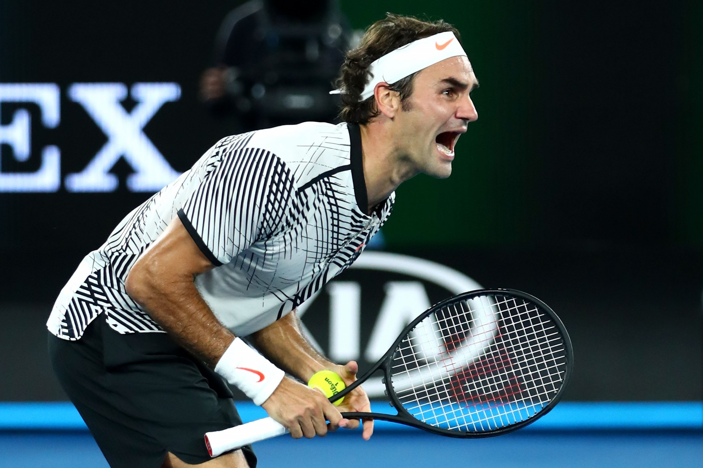

```{r setup, include = FALSE}
options(htmltools.dir.version = FALSE)

library(dplyr)
library(ggplot2)
library(ggthemes)
library(doMC)
library(htmlTable)

registerDoMC(cores = 4)
```

class: slide-img

# Sport Prediction

.cbox[
### Predicting _who will win_ is the holy grail of sports analytics. 
]

--

<br>

- Much research in sports analytics focuses on building prediction models for performance outcomes

- In this portion of the tutorial, we will get familiar with ways to build and evaluate prediction models in `R`

---

# Tutorial Prediction Objective

.cbox[
Tennis commentators and fans often look to match statistics to understand how a player won a match. But which stats are the most important for winning?
]

--

<br>

- In this tutorial, we will build a prediction model for a match win to help to answer this question.

- As we learn about prediction modelling techniques, we will apply these ideas to the match statistics problem using the `diff_stats` dataset.

---

# Descriptive vs Predictive Models

--

*  _Predictive modeling_ usually refers to machine learning  

--

* The goal of these techniques is to improve predictive performance

--

* This is a very different goal from statistical models, like regression, where inference and interpretation are of primary importance

--

* Predictive models will often sacrifice interpretability for improved performance


---

# Describe Before You Predict

* Because it is often a challenge to interpret the "how" of machine learning methods, it is good practice to first do some statistical modelling

* The reasons for this include:

  - Getting familiar with the interrelationships in your data 
  
  - Identifying any issues not flagged during EDA
  
  - Developing some expectations for the predictive modelling results


---

# Example: Statistical Modeling

- Our goal for the tutorial is to understand the key drivers of wins among 12 differential statistics (the difference between one player and the opponent) for the previous 30 matches up to the current match

- Out outcome is a *binary* variable named `winner`

- Given this outcome, we will use `logistic regression` as our statistical model


<div align="center">

</div>


---

# Example: Logistic Regression

```{r}
library(WOMBATsport) # Load our tutorial package

data(diff_stats)

str(diff_stats) # Examine our variables
```

---

# Example: Logistic Regression

We use `R`'s model convention: `formula = outcome ~ x1 + x2 + ...` and `glm` to fit the logistic model.

```{r}
fit <- glm(winner ~ .,
           data = diff_stats %>% 
              select(winner, dplyr::contains("diff")),
           family = binomial) # Family binomial for logistic

summary(fit)
```

---

# Interpretation: Logistic Regression

.cbox[
### What do we learn from the logistic regression?
]

--

<br>

1. There are several strong effect sizes, including the differential in total points won, return points won, and second service points won. 

2. There is a mix of positive and negative associations

3. There are some large standard errors, which suggests strong correlation/colinearity among the features

---

# Predictive Modelling with `caret`

--

* The `caret` package, written by Max Kuhn, is a great resource for machine learning in `R`

--

* `caret` stand for Classification And REgression Training 

--

* It includes 100+ predictive modelling methods

--

* It provides a unified & streamlines interface for building and evaluating models

--

* It allows parallel processing for faster computation

--

* You can install with `install.packages('caret')`

---

# Modelling Steps

--

Step 1. Decide how to spend your data

--

Step 2. Split the data into training and test

--

Step 3. Conduct pre-processing (as needed)

--

Step 4. Train the model

--

Step 5. Evaluate the model with test data

---

# Spending Data

.cbox[
_Spending data_ is the process of dividing data into training and test sets.
]

--

<br>

When going through this process, you need to decide:

1. How much to devote to training?

2. How you are going to divide the data?


---

# Why Split Up the Data at All?

- Testing our data on independent samples is the strongest form of validation and evaluation

- If we trained and tested on the same data, we risk _overfitting_ which is the machine-learning equivalent to a "Monday morning quarterback"


---

# How and How Much to Spend?


* How much to spend is a balance between training accuracy and testing precision

* There is no hard and fast rule but allocation of 30% to testing is common practice

---

# How and How Much to Spend?

* How we spend also concerns the _way_ we sample our test dataset

* We could use random sampling but this could result in imbalanced datasets

* It would be better to make sure the proportion of cases is preserved in each

* Also, if there are any rare features, that should be accounted for in sampling as well

* We can do this with the `caret` function `createDataPartition`

---

# Using `createDataPartition`

Here is the syntax and main arguments for `createDataPartition`:

```{r eval = FALSE}
createDataPartition(y, times, p, list, ...)
```

<br>

```{r echo = FALSE}
data <- data.frame(
  "Argument" = c("y", "times", "p", "list"),
  "Description" = c(
    "Outcome vector to balance sampling on",
    "Number of partitions",
    "Proportion of each partition allocated to training",
    "Logical whether list is returned"
  )
)


htmlTable(data, 
          rnames = F, 
          col.rgroup = c("none", "#F7F7F7"),
          align = c("ll"),
          css.cell = "padding-left: 5%; padding-right:0%; padding-top: 2%;padding-bottom: 2%;"
          )
```


---

# Example: Partitioning Data

In our development, we will create one partition with 70% of our dataset allocated to training.

```{r message = FALSE}
library(caret) # Load caret

# Returns matrix of indices for obs in training
train <- createDataPartition(
  y = diff_stats$winner,
  times = 1,
  p = 0.7,
  list = F
)

diff_stats$train <- 0
diff_stats$train[train[,1]] <- 1 # Indicator for training
```

---

# Pre-Processing

.cbox[
Before we split our data, we need to pre-process our data. The pre-processing can protect against some loss in model accuracy due to scale, skew, or high correlation.
]

--

<br>


Common pre-processing steps are:

1. Centering - Give all variables a common mean of 0

2. Standardizing - Give all variables a common scale

3. Remove highly correlated variables

4. Reduce dimension (when $n \sim p$)

---

# Example: Pre-Processing

For the `diff_stats` we will standardize and remove highly correlated variables as part of our pre-processing. First, we collect our features.

```{r}
features <- grep("diff", names(diff_stats))
```

--

Next, we use `scale` to center and standardize the scale of our features.

```{r}
diff_stats[,features] <- scale(diff_stats[,features])
```

---

# Example: Check for High-Correlation

Next, we look for any variables with correlation $|r| > .95$. This finds no cases meeting this criteria, so we retain all the features.

```{r}
correlation <- cor(diff_stats[,features]) # Get correlation matrix

correlation <- abs(round(correlation, 2)) # Get absolute value, round

# Check and exclude diagonal
any(correlation > .95 & row(correlation) != col(correlation)) 
```

---

# Preparing Outcome

- The last pre-processing step is the preparation of our outcome variable.

- For classification problems, where we have a categorical outcome, we want to create a factor as many of the `caret` models and functions expect this.

- Here we transform `winner` into a factor.

<br>

```{r}
diff_stats$winner <- factor(diff_stats$winner, 
                            labels = c("Loser", "Winner"))
```

---

# Splitting Data

Now we are ready to create our testing and training datasets.

```{r}
trainingData <- diff_stats %>%
	dplyr::filter(train == 1) %>%
	select(winner, dplyr::contains("diff"))

testData <- diff_stats %>%
	dplyr::filter(train == 0) %>%
	select(winner, dplyr::contains("diff"))
```

---

# The `train` Function

The main workhouse function for model training in `caret` is `train`. Here are the main arguments you need to know to get started.

```{r echo = FALSE}
data <- data.frame(
  "Argument" = c("form", "data", "method", "metric", "tuneLength", "trControl", "tuneGrid"),
  "Description" = c(
    "Formula (y ~ x)",
    "Data frame of training data",
    "Character of the ML method to be used",
    "Performance metric for summarizing",
    "Sets granularity for tuning parameter if tuneGrid not specified",
    "Control parameters for training",
    "Data frame that gives explicit range for tuning parameters"
  )
)


htmlTable(data, 
          rnames = F, 
          col.rgroup = c("none", "#F7F7F7"),
          align = c("ll"),
          css.cell = "padding-left: 5%; padding-right:0%; padding-top: 2%;padding-bottom: 2%;"
          )
```

---

# Training Control

* The `trControl` argument is a list that controls a number of aspects of training including resampling and how we summarise performance with each resample.

* The resampling is an important additional measure to protect against overfitting when training 


<div align="center">

</div>


---

# Example: Using `trControl`

In our example, we will use `trControl` to use 5-fold cross validation and a two-class summary for our performance measures.

```{r}
ctrlSpecs <- trainControl(
	method = "repeatedCV",
	repeats = 5,
	summaryFunction = twoClassSummary, # function from caret
	classProbs = TRUE # Needed to use twoClassSummary
)
```


---

# Grid Tuning

* The `tuneGrid` is a way to give a specific grid for the tuning parameters of the method

* You can use `expand.grid` to make a range of parameters

* To determine the parameters to tune and their variable names you can use `getModelInfo`

---

# Using `getModelInfo`

* We can get a model of interest with `getModelInfo('model')` or get info from all models with `getModelInfo()`.

* This returns a list per model with information about the model type, parameters, grid function, etc.

* Here is an example with the `rpart` model.

```{r}
getModelInfo('rpart')[['rpart']][1:4]
```

---

# Performance Metrics

* We can use the `metric` argument to choose our performance metric for training evaluation

* There are many metrics for evaluating classification. In general, it is best to choose one when choosing among model approaches

```{r echo = FALSE}
data <- data.frame(
  "Metric" = c("Accuracy", "AUC", "Sensitivity", "Specificity", "LogLoss"),
  "Description" = c(
    "Proportion of exactly correct classifications",
    "Area under the ROC curve",
    "The true positive rate (also called 'recall')",
    "The true negative rate",
    "Prediction-weighted loss function"
  )
)


htmlTable(data, 
          rnames = F, 
          col.rgroup = c("none", "#F7F7F7"),
          align = c("ll"),
          css.cell = "padding-left: 5%; padding-right:0%; padding-top: 2%;padding-bottom: 2%;width:40%;"
          )
```

---

# Setting Performance Metric

There is no one correct performance measure. In fact, multiple should be evaluated when testing. For training, the "log loss" is good all around measure. Here is how we can set our control specs to use it.

```{r}
ctrlSpecs <- trainControl(
	method = "repeatedCV",
	repeats = 5,
	summaryFunction = mnLogLoss,
	classProbs = TRUE
)
```

---

# Models

There are many, many model options in `caret`. It won't be possible to look at them all here but we will consider examples from three major categories of model.

```{r echo = FALSE}
data <- data.frame(
  "Category" = c("Forest", "Boosted", "Support Vector Machines"),
  "Description" = c(
    "Ensemble of multiple decision trees with bagging (boostrap aggregation)",
    "Incremental building of multiple classifiers, which is a kind of correlated ensembling",
    "Collection of regression lines that try to maximally separate classes"
  ),
  "Examples" = c("rf, rfRules, cforest", "gbm, adaboost, C5.0", "svmLinear, svmRadial")
)


htmlTable(data, 
          rnames = F, 
          col.rgroup = c("none", "#F7F7F7"),
          align = c("ll"),
          css.cell = "padding-left: 5%; padding-right:0%; padding-top: 2%;padding-bottom: 2%;"
          )
```

---

# Random Forest

Let's have a look at each category and how we could train each in `caret`. Below we use the `rf` method to fit a random forest. The `tuneLength` is set to 10 to have a randomly generated grid for the forest parameters.

```{r eval = TRUE, message = FALSE}
set.seed(1115)

rfFit <- train(
	winner ~ .,
	data = trainingData,
	method = "rf",
	tuneLength = 10,
	trControl = ctrlSpecs,
	metric = "logLoss"
)
```

---

# Evaluate the Model

* We can see the results across the different tuning parameters using: `print` or `plot`

* The selected model can be extracted with `finalModel` and it will have all the class properties of the source method

---

# Example: Evaluate Models

```{r}
plot(rfFit) # Plot log-loss across grid parameters
```

---

# Example: Evaluate Models

```{r message = FALSE}
library(randomForest) # Class methods for RF
importance(rfFit$finalModel) # Variable importance
```

---

# Boosting: C5.0

The `C5.0` algorithm is a variant of `adaboost`. Here we set up a tailor-made tuning grid for `C5.0` and then train the model.

```{r eval = TRUE, message = FALSE}
set.seed(1115)

tuneGrid <- expand.grid(
	.model = "tree",
	.trials = 1:100,
	.winnow = FALSE
)

C5Fit <- train(
	winner ~ .,
	data = trainingData,
	method = "C5.0",
	tuneGrid = tuneGrid,
	trControl = ctrlSpecs,
	metric = "logLoss"
)
```

---

# Results of C5.0

```{r}
plot(C5Fit)
```

---

# Support Vector Machines

The final method we consider is an SVM with a linear kernel. This is performed with method `svmLinear` and we setup a grid of 12 costs (the penalty for overlapping points).

```{r eval = TRUE, message = FALSE}
set.seed(1115)

tuneGrid <- expand.grid(
	.C = 2^(-4:7)
)

svmFit <- train(
	winner ~ .,
	data = trainingData,
	method = "svmLinear",
	tuneGrid = tuneGrid,
	trControl = ctrlSpecs,
	metric = "logLoss"
)
```

---

# Results: SVM

```{r}
plot(svmFit)
```

---

# Comparing Resamples

* By setting the seed to the same place with each model fit, we can use the `resamples` function to compare the performance of models in each sample directly

```{r}
resampledFit <- resamples(
  list(RF = rfFit, C50 = C5Fit, SVM = svmFit)
  )
```

---

# Comparing Resamples

```{r}
dotplot(resampledFit, metric = "logLoss")
```

---

# Test Performance

.cbox[
### But what about performance in our test data?
]

<br>

- We can use `predict` to get class predictions with our test data

- An array of performance measures can be calculated with `confusionMatrix`

---

# Example: Test Performance

```{r}
predictions <- predict(svmFit, testData) # automatically takes final model

confusionMatrix(predictions, testData$winner)
```


---

# Interpreting Confusion Matrix

```{r echo = FALSE}
data <- data.frame(
  "Metric" = c("No Information Rate", "Kappa", "Pos Pred Value", "Neg Pred Value", "Prevalence", "Detection Rate", "Detection Prevalence", "Balanced Accuracy"),
  "Description" = c(
    "Largest proportion of observed (chance level)",
    "Agreement measure",
    "Chance of case given case was predicted",
    "Chance of not being case given case was not predicted",
    "Prevalnce of true cases",
    "Prevalence of correctly predicted cases",
    "Prevalence of detected cases",
    "Average of sensivity and specificity"
      )
)


htmlTable(data, 
          rnames = F, 
          col.rgroup = c("none", "#F7F7F7"),
          align = c("ll"),
          css.cell = "width:40%;"
          )
```

---

# Parallel Processing

You might have noticed that running `train` can be slow.

--

* `caret` has built-in parallel processing

* unix and OSX users can access this functionality by registering multiple cores with the `doMC` package

---

# Summary

--

* We've reviewed the major steps of developing and evaluating prediction models

--

* `caret` provides a comprehensive, systematic approach for carrying out these steps

--

* Application of several of these approaches to tennis match statistics suggest that rolling averages over past 30 matches can yield match predictions of at least 63%.

* Further, we find the the total points won, total service points won, and second service points won were some of the most predictive stats of those considered

---

# Resources


* [Web book on caret](http://topepo.github.io/caret/index.html)


* [Applied Predictive Modeling](https://www.amazon.com/dp/1461468485?tag=inspiredalgor-20) 

* [Introduction to Statistical Learning](https://www.amazon.com/dp/1461471397?tag=inspiredalgor-20)


