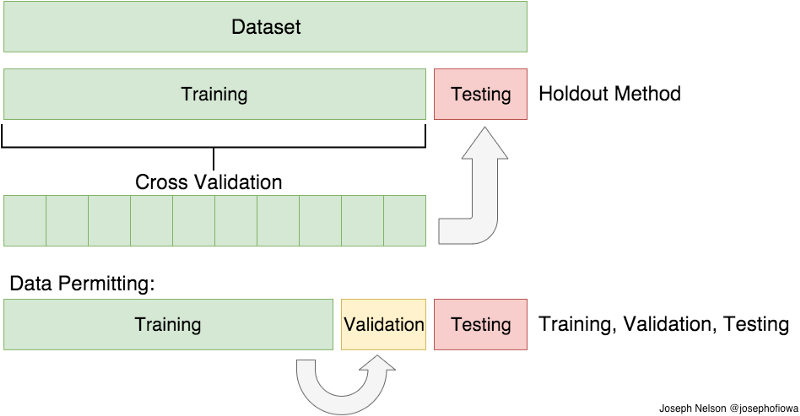

```{r setup, include = FALSE}
options(htmltools.dir.version = FALSE)

library(dplyr)
library(ggplot2)
library(ggthemes)
library(doMC)
library(htmlTable)

registerDoMC(cores = 4)
```

class: slide-img

# Sport Prediction


.left[

]

.right[
### Predicting _who will win_ is the holy grail of sports analytics and is a major research area of interest for sports statisticians.
]


---

# Descriptive vs Predictive Models

--

*  _Predictive modeling_ usually refers to machine learning  

--

* The goal of these techniques is to improve predictive performance

--

* This is a very different goal from statistical models, like regression, where inference and interpretation are of primary importance

--

* Predictive models will often sacrifice interpretability for improved performance


---

# Question: Study Objectives

Consider the following studies and there objectives. Decide whether you think a descriptive or predictive analysis is more appropriate.

<br>

Study 1. A researcher has designed three different training regimes and wants to understand which is the most effective. 

Study 2. A research team has gathered historical data about player characteristics and injury occurrence. They want to use these data to create a tool to assess athlete risk of injury risk in the future.


---

# Solution: Study Objectives


Study 1. Descriptive analysis

<br>

Study 2. Predictive analysis


---

# Describe Before You Predict

* Because it is often a challenge to interpret the "how" of machine learning methods, it is good practice to first do some statistical modelling (e.g. `glm(y ~ x + ...)`)

* The reasons for this include:

  - Getting familiar with the interrelationships in your data 
  
  - Identifying any issues not flagged during EDA
  
  - Developing some expectations for the predictive modelling results


---

# Predictive Modelling with `caret`

.left[
* Once you are ready to develop your prediction model, the `caret` package, written by Max Kuhn, is a great resource for machine learning in `R`

* `caret` stand for Classification And REgression Training 

* It includes 100+ predictive modelling methods

* It provides a unified & streamlines interface for building and evaluating models

* It allows parallel processing for faster computation

* You can install with `install.packages('caret')`
]

.right[
<div align="center">

</div>
]

---

# Modelling Steps

--

Step 1. Decide how to spend your data

--

Step 2. Split the data into training and test

--

Step 3. Conduct pre-processing (as needed)

--

Step 4. Train the model with resampling

--

Step 5. Evaluate the model with test data

---


# Why Split Up the Data at All?

- Testing our data on independent samples is the strongest form of validation and evaluation

- If we trained and tested on the same data, we risk _overfitting_ which is the machine-learning equivalent to a "Monday morning quarterback"

- We also resample among training for additional protection against overfitting


---

# Using `createDataPartition`

We can use `createDataPartition` to split our data:

```{r eval = FALSE}
createDataPartition(y, times, p, list, ...)
```

<br>

```{r echo = FALSE}
data <- data.frame(
  "Argument" = c("y", "times", "p", "list"),
  "Description" = c(
    "Outcome vector to balance sampling on",
    "Number of partitions",
    "Proportion of each partition allocated to training",
    "Logical whether list is returned"
  )
)


htmlTable(data, 
          rnames = F, 
          col.rgroup = c("none", "#F7F7F7"),
          align = c("ll"),
          css.cell = "padding-left: 5%; padding-right:0%; padding-top: 2%;padding-bottom: 2%;"
          )
```

*Note:* Using 70% of our data for training is typical

---

# Example: Partitioning Data

In this example, we create one partition with 70% of our dataset allocated to training.

```{r message=FALSE, echo = FALSE}
library(caret)
```

```{r eval = FALSE}
library(caret) # Load caret

# Returns matrix of indices for obs in training
train <- createDataPartition(
  y = data$outcome,
  times = 1,
  p = 0.7,
  list = F
)
```

---

# Practice: Using CreateDataPartition

Modify the previous code to obtain 5 partitions for your training samples with 60% of observeations in each devoted to training.

--

<br>

_Answer:_


```{r eval = FALSE}
train <- createDataPartition(
  y = data$outcome,
  times = 5,
  p = 0.6,
  list = F
)
```

---


# Pre-Processing

.cbox[
Before we split our data, we need to pre-process our data. The pre-processing can protect against some loss in model accuracy due to scale, skew, or high correlation.
]

<br>

Common pre-processing steps are:

1. Centering - Give all variables a common mean of 0

2. Standardizing - Give all variables a common scale

3. Remove highly correlated variables

4. Reduce dimension (when $n \sim p$)

---

# The `train` Function

The main workhouse function for model training in `caret` is `train`. Here are the main arguments you need to know to get started.

```{r echo = FALSE}
data <- data.frame(
  "Argument" = c("form", "data", "method", "metric", "tuneLength", "trControl", "tuneGrid"),
  "Description" = c(
    "Formula (y ~ x)",
    "Data frame of training data",
    "Character of the ML method to be used",
    "Performance metric for summarizing",
    "Sets granularity for tuning parameter if tuneGrid not specified",
    "Control parameters for training",
    "Data frame that gives explicit range for tuning parameters"
  )
)


htmlTable(data, 
          rnames = F, 
          col.rgroup = c("none", "#F7F7F7"),
          align = c("ll"),
          css.cell = "padding-left: 5%; padding-right:0%; padding-top: 2%;padding-bottom: 2%;"
          )
```

---

# Practice: Pre-Processing

What function would you use to standardize your model features?

--

<br>

_Answer:_ The `scale` function

---


# Training Control

* The `trControl` argument is a list that controls a number of aspects of training including resampling and how we summarise performance with each resample.

* The resampling is an important additional measure to protect against overfitting when training 


<div align="center">

</div>


---

# Example: Using `trControl`

In our example, we will use `trControl` to use 5-fold cross validation and a two-class summary for our performance measures.

```{r eval = FALSE}
ctrlSpecs <- trainControl(
	method = "repeatedCV",
	repeats = 5,
	summaryFunction = twoClassSummary, # function from caret
	classProbs = TRUE # Needed to use twoClassSummary
)
```


---

# Grid Tuning

* The `tuneGrid` is a way to give a specific grid for the tuning parameters of the method

* You can use `expand.grid` to make a range of parameters

* To determine the parameters to tune and their variable names you can use `getModelInfo`

---

# Using `getModelInfo`

* We can get a model of interest with `getModelInfo('model')` or get info from all models with `getModelInfo()`.

* This returns a list per model with information about the model type, parameters, grid function, etc.

* Here is an example with the `rpart` model.

```{r}
getModelInfo('rpart')[['rpart']][1:4]
```

---

# Performance Metrics

* We can use the `metric` argument to choose our performance metric for training evaluation

* There are many metrics for evaluating classification. In general, it is best to choose one when choosing among model approaches

```{r echo = FALSE}
data <- data.frame(
  "Metric" = c("Accuracy", "AUC", "Sensitivity", "Specificity", "LogLoss"),
  "Description" = c(
    "Proportion of exactly correct classifications",
    "Area under the ROC curve",
    "The true positive rate (also called 'recall')",
    "The true negative rate",
    "Prediction-weighted loss function"
  )
)


htmlTable(data, 
          rnames = F, 
          col.rgroup = c("none", "#F7F7F7"),
          align = c("ll"),
          css.cell = "padding-left: 5%; padding-right:0%; padding-top: 2%;padding-bottom: 2%;width:40%;"
          )
```

---

# Setting Performance Metric

There is no one correct performance measure. In fact, multiple should be evaluated when testing. For training, the "log loss" is good all around measure. Here is how we can set our control specs to use it.

```{r eval = FALSE}
ctrlSpecs <- trainControl(
	method = "repeatedCV",
	repeats = 5,
	summaryFunction = mnLogLoss,
	classProbs = TRUE
)
```

---

# Practice: Alternative Resampling

Look at the `method` options using the documentation on `trainControl`. Find an alternative resampling approach and modify the `ctrlSpecs` object to use this method.

--

<br>

In this alternative we use 10 bootstrap resamples:


```{r eval = FALSE}
ctrlSpecs <- trainControl(
	method = "boot",
	repeats = 10,
	summaryFunction = mnLogLoss,
	classProbs = TRUE
)
```

---

# Models

There are more than 100 models to try in `caret`! Below is just a sample of some popular kinds. The full list is available with the online [caret book](http://topepo.github.io/caret/available-models.html). 

```{r echo = FALSE}
data <- data.frame(
  "Category" = c("Forest", "Boosted", "Support Vector Machines"),
  "Description" = c(
    "Ensemble of multiple decision trees with bagging (boostrap aggregation)",
    "Incremental building of multiple classifiers, which is a kind of correlated ensembling",
    "Collection of regression lines that try to maximally separate classes"
  ),
  "Examples" = c("rf, rfRules, cforest", "gbm, adaboost, C5.0", "svmLinear, svmRadial")
)


htmlTable(data, 
          rnames = F, 
          col.rgroup = c("none", "#F7F7F7"),
          align = c("ll"),
          css.cell = "padding-left: 5%; padding-right:0%; padding-top: 2%;padding-bottom: 2%;"
          )
```

---

# Random Forest

Let's have a look at each category and how we could train each in `caret`. Below we use the `rf` method to fit a random forest. The `tuneLength` is set to 10 to have a randomly generated grid for the forest parameters.

```{r eval = FALSE, message = FALSE}
rfFit <- train(
	outcome ~ .,
	data = trainingData,
	method = "rf",
	tuneLength = 10,
	trControl = ctrlSpecs,
	metric = "logLoss"
)
```

---

# Practice: Grid Tuning

Use `getModelInfo` to find the tuning parameters for the `rf` method. Create a data frame with 10 different options and modify the `train` function to use these in place of the random tuning with `tuneLength`.

--

```{r}
# Find tuning parameters
getModelInfo("rf")[["rf"]]$parameters
```

```{r, eval = FALSE}
grid <- data.frame(.mtry = seq(5, 25, length = 10))

# Modify train function
rfFit <- train(
	outcome ~ .,
	data = trainingData,
	method = "rf",
	tuneGrid = grid,
	trControl = ctrlSpecs,
	metric = "logLoss"
)
```

---

# Evaluate the Model

--

* We can see preformance metrics across the different tuning parameters using: `print` or `plot`

--

* Also, the selected model can be extracted with `finalModel` and it will have all the class properties of the source method

--

For example, with a random forest, we can look at feature importance:

```{r message = FALSE, eval = FALSE}
library(randomForest) # Class methods for RF

importance(rfFit$finalModel) # Variable importance
```


---

# Resources


* [Web book on caret](http://topepo.github.io/caret/index.html)


* [Applied Predictive Modeling](https://www.amazon.com/dp/1461468485?tag=inspiredalgor-20) 

* [Introduction to Statistical Learning](https://www.amazon.com/dp/1461471397?tag=inspiredalgor-20)


