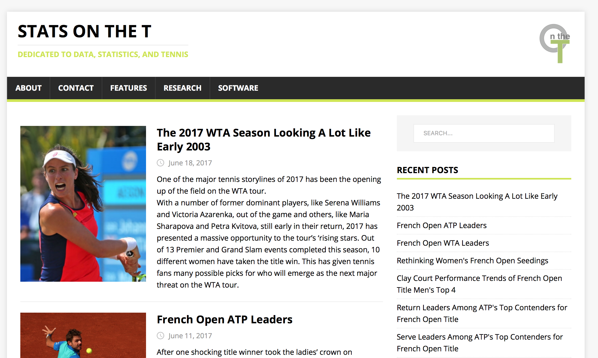
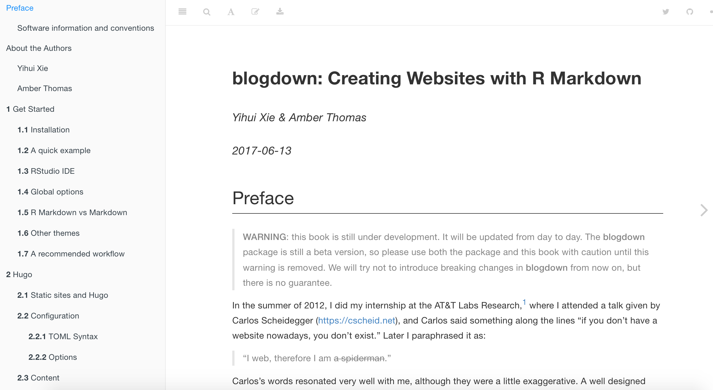

```{r setup, include = FALSE}
options(htmltools.dir.version = FALSE)

library(htmlTable)
```


class: slide-img

# Why Blog?

Sharing your ideas with the world is one of the most joyful parts of sports analysis.

<div align="center">

</div>


---


class: slide-img

# 'On The T' Powered By Blogdown

[on-the-t.com](http://on-the-t.com/)



---


# Getting There

.left[
- Starting a blog might seem overwhelming but, if you know `R` and some basic CSS, it's easy


- Producing interesting content is the tough part about blogging


- `R` helps to let you focus on _content_ by providing easy-to-use tools that solve the technical details of going from code to the Web 

- _If you can write R markdown, you can create a blog!_
]

.right[
<div align="center">

</div>
]

---

# Blogdown

--

* Package for writing a blog in R 

--

* Create content with R markdown

--

* Generate site with `Hugo`, a static site generator

--

* Deploy on Github, Netlify, or other hosting services

--

* Authored by Yihui Xie (who is at the conference!)


---

# Getting Started

Here are the major functions you will use with `blogdown`.

```{r echo = FALSE}
data <- data.frame(
	Function = c(
	"install_hugo",
	"install_theme",
	"build_site",
	"html_page",
	"hugo_cmd",
	"new_content",
	"new_site",
	"serve_site"
	),
	Description = c(
		"Downloads and installs Hugo",
		"Downloads a Hugo theme from github",
		"Compiles Rmd files and builds the site",
		"Renders an Rmd file as an HTML that can be read by Hugo",
		"Run Hugo commands",
		"Creates new file in working directory",
		"Creates enviroment for new site",
		"Preview working version of your site"
	)
)


htmlTable(data, 
          rnames = F, 
          col.rgroup = c("#fff", "#eeeeee"),
          align = "ll",
          css.cell = "padding:2%;")
```


---

# Learning the Workflow

Yihui and Amber Thomas have a draft manual for using blogdown that will [get you started](https://bookdown.org/yihui/blogdown/).



---

# Worklow Overview

1. Install `blogdown` and run `install_hugo`

2. Use `new_site` to create your site directory

3. Setup your directory with `git` and push to `github`

4. Choose your own theme choosing from [themes.gohugo.io](http://themes.gohugo.io/) and use `install_theme`

5. Configure your site by modifying `config` file

6. Create new pages with `new_post`

7. _Deploy!_

---

# Adding Interactive Graphics

.left[
- All sports blogs should use charts! And you can make your blog charts especially interesting by making them interactive.

- For `R` users who already masters of `ggplot2`, the `plotly` package is a flexible and fast way to create interactive Web graphics
]

.right[
<div>
    <a href="https://plot.ly/~on-the-t/1221/?share_key=ZjcORFd1wz33fmAeDoXSNe" target="_blank" title="women_2017_french_open_seeds" style="display: block; text-align: center;"></a>
    <script data-plotly="on-the-t:1221" sharekey-plotly="ZjcORFd1wz33fmAeDoXSNe" src="https://plot.ly/embed.js" async></script>
</div>

]

---

# Plotly

.hbox[
<p style="font-size:24px;">Plotly is a free online service for creating and sharing Web graphics. With the `plotly` package (by Carson Sievert) you can transform `ggplots` to interactive charts on plotly.</p>
]


---

# Getting Started with Plotly

Here are the basic steps to follow:

```{r eval = FALSE}
install.packages(plotly)

library(plotly)

# After creating a plotly account
Sys.setenv("plotly_username"="your_plotly_username") 
Sys.setenv("plotly_api_key"="your_api_key")

<CREATE GGPLOT>
  
plotly_POST(gg1, filename = "my-new-plot") # Publish
```


---

# Plotly Site

Further customization can be done on the plotly site.


---

# Plotly Embed

Under the `Share` link you can also find the code that you can use to embed your final plot in your R Markdown file.


---

class: slide-img

# Summary

.left[
* Doing sports analytics requires a lot of skills

* Many tools in `R` can make capturing, cleaning, and analyzing data much easier

* I hope much of what you have seen in this presentation will help you make your ideas about sports data into a reality 
]

.right[
<div align="center">

</div>
]

---

# Resources

- [blogdown](https://bookdown.org/yihui/blogdown/)

- [plotly](https://plot.ly/r/getting-started/)

- [Git Commands](https://confluence.atlassian.com/bitbucketserver/basic-git-commands-776639767.html)


---

class: center

<br>


