```{r setup, include = FALSE}
options(htmltools.dir.version = FALSE)

library(htmlTable)
```

class: slide-img

# Publishing

### One of the most popular and efficient ways of sharing analysis in sports is through *blogging*.

<div align="center">

</div>

---

# Getting There

--

- Starting a blog might seem overwhelming but, if you know `R` and some basic CSS, it's easy

--

- Producing interesting content is the tough part about blogging

--

- `R` helps to let you focus on _content_ by providing easy-to-use tools that solve the technical details of going from code to the Web 


---

# Blogdown

--

* Package for writing a blog in R 

--

* Create content with R markdown

--

* Generate site with `Hugo`

--

* Deploy on Github, Netlify, or other hosting services

--

* Authored by Yihui Xie (who is at the conference!)


---

# What is Hugo?

.cbox[
Hugo is a static Web site generator with heaps of custom themes that make it simple to create a beautiful site.
]

--

<br>

* Hugo works with any operating system in the same way

* It handles many pages of content efficiently

* Hugo (like `R`) also has a very active user community

* *However* Hugo is intended only for static sites were HTML content is fixed no matter what the user behavior

---

# Getting Started

Here are the major functions you will use with `blogdown`.

```{r echo = FALSE}
data <- data.frame(
	Function = c(
	"install_hugo",
	"install_theme",
	"build_site",
	"html_page",
	"hugo_cmd",
	"new_content",
	"new_site",
	"serve_site"
	),
	Description = c(
		"Downloads and installs Hugo",
		"Downloads a Hugo theme from github",
		"Compiles Rmd files and builds the site",
		"Renders an Rmd file as an HTML that can be read by Hugo",
		"Run Hugo commands",
		"Creates new file in working directory",
		"Creates enviroment for new site",
		"Preview working version of your site"
	)
)


htmlTable(data, 
          rnames = F, 
          col.rgroup = c("#fff", "#eeeeee"),
          align = "ll",
          css.cell = "padding:2%;")
```


---

# Example Workflow

1. Create a repo for your blog on Github (you need to have an account). Here is my example:

<div align="center">

</div>

---

# Example Workflow


2. Choose a directory for your repo and clone it there. Here, I put my repo under the path `/Software`:

<br>

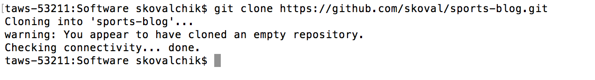

---

# Set Server Daemon

--

- By default, when running your site locally, your `R` session will be blocked

--

- To prevent this, you can use change your options `options(servr.daemon = FALSE)`

--

- You can do this at the start of each blogging session 

--

- _Or_ fix it permanently in your `.Rprofile` file

---

# Example Workflow


3. In `R`, load `blogdown`

4. Install Hugo

5. `setwd` into the repo directory and create a new site

```{r eval = FALSE}
library(blogdown)

install_hugo() # On a Mac you need homebrew

options(servr.daemon = FALSE) # If not in Rprofile

# setwd() to blog directory

new_site()
```

---

# Starting Site

You should see a browser open with the following default layout:

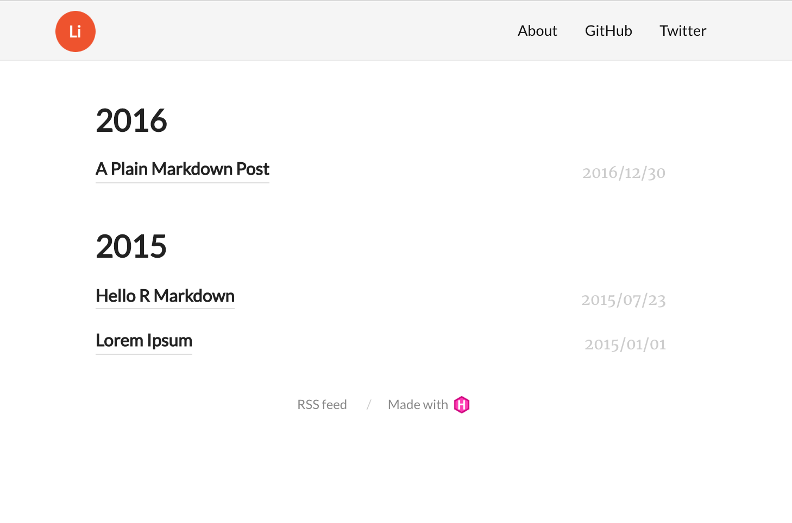


---

# Site Folders

Also, if you look under your blog repo, you will see that a number of new folders were created. These are all the elements needed to get your site up and running.

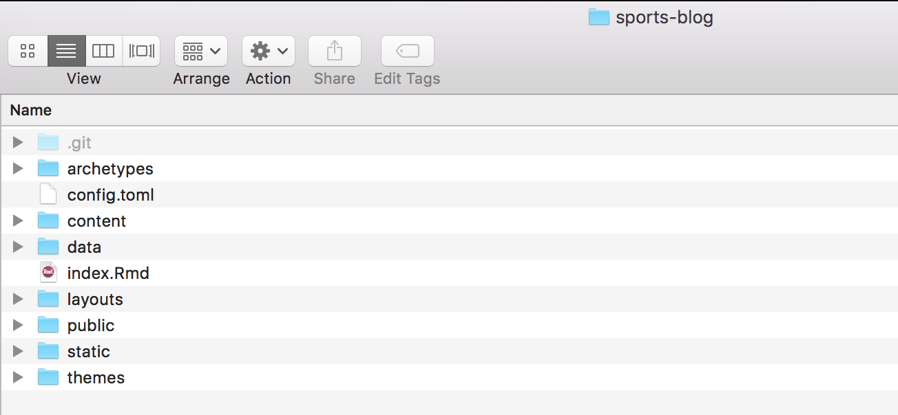

---


# Choosing a New Theme


* The default theme for the site is `Lithium`

* To set your own style, you can choose from hundreds of other themes
 at [themes.gohugo.io](http://themes.gohugo.io/) 
 
* When you find one you like you can add it to your site with `install_theme`

<div align="center">
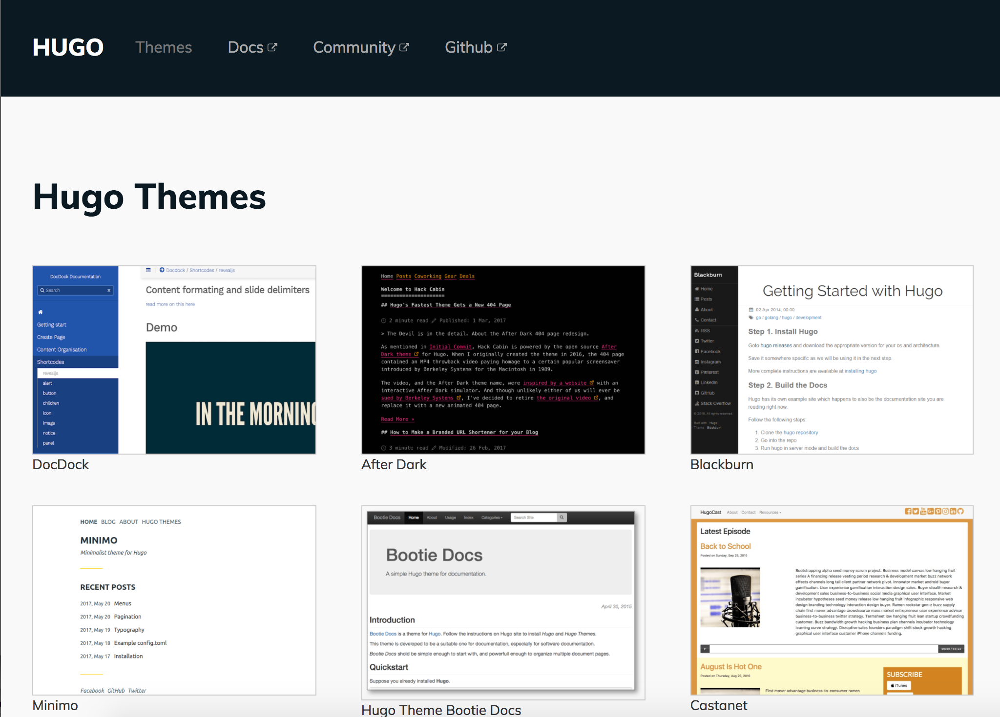
</div>


---

# Example: Install Theme

In this example, I add theme `mainroad`:

```{r eval = FALSE}
install_theme('vimux/mainroad',
	theme_example = TRUE, 
	update_config = TRUE
)
```

---

# Example: Install Theme

I can preview the site with the `serve_site`. Here is what the new theme looks like:

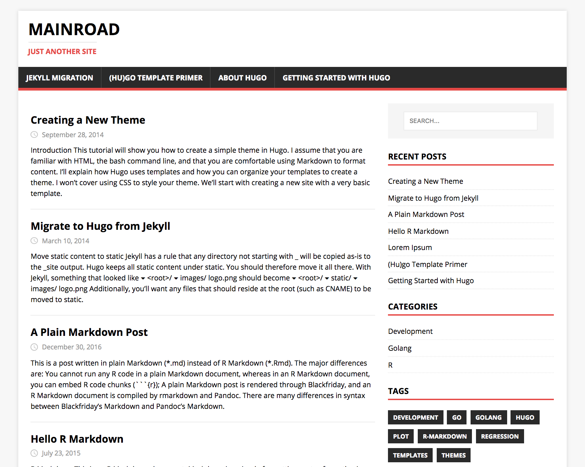


---

# Configuring Site

In your blog repo, you will see a `config.toml` file. This is where you can update the elements on your main page (which will be `index.html`). Below I've highlighted some fields to update with the `Mainroad` config file.

<div align="center">
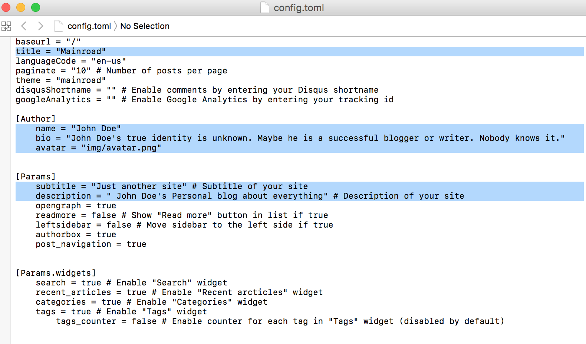
</div>


---

# New Configuration 

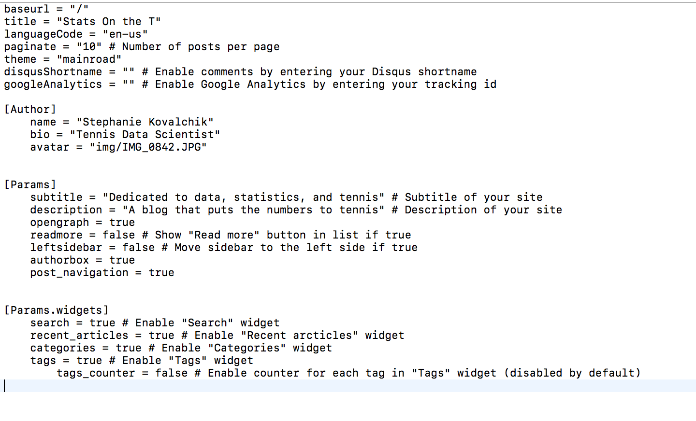

---

# Updated Site

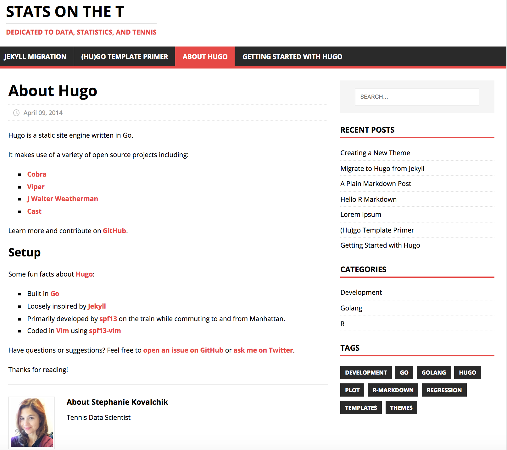

---

# Creating New Post

You can generate new posts in R markdown (or markdown) files using `new_post`. Here is an example.

```{r eval = FALSE}
new_post(
	title = "French Open 2017",
	kind = "default"
)
```

---

# Creating a New Post

This will open an editor, where you can enter any additional meta-data and start to create content, just like you would with `R` markdown.

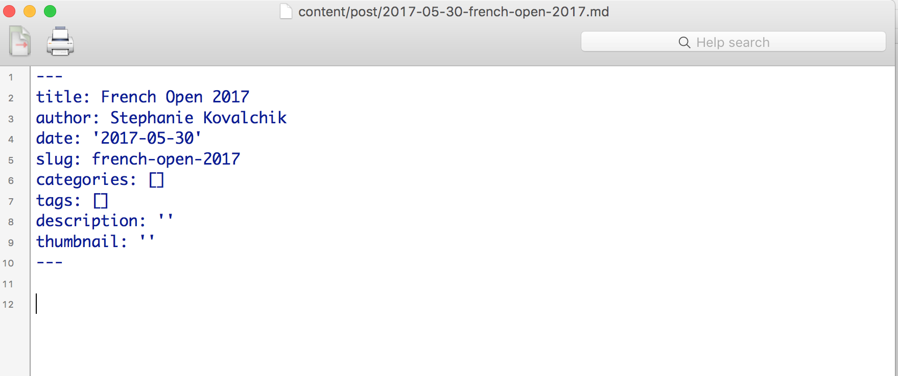

---

# Location of New Post

The post will exist under the `content/post` folder.

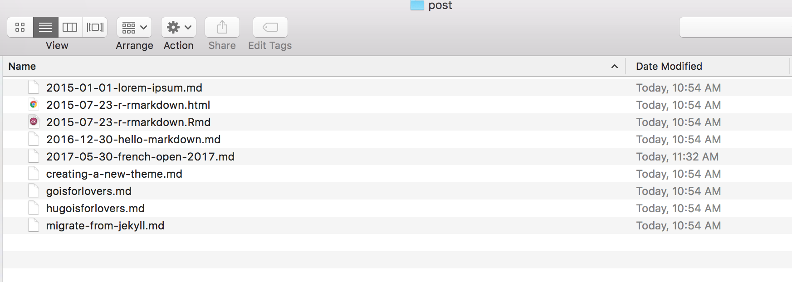

---

# Site Update

If you have your interactive session open, the site will automatically update with the post.

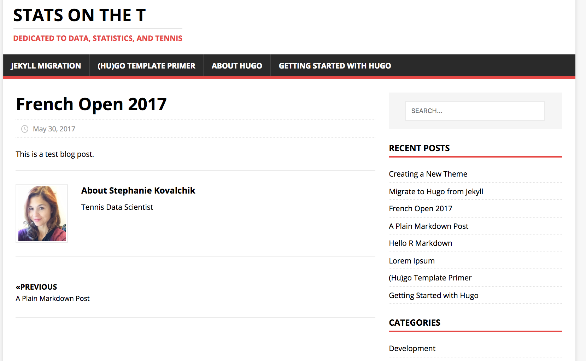

---

# Deploying

1. When you are ready to publish your site, you can use the `build_site(local = FALSE)` function, which compiled Rmd and runs Hugo to prepare your site for publication.

2. You will need to select a service for hosting your site. There are many options, like:
  - [Netlify](https://www.netlify.com/)
  - [Github IO](https://pages.github.com/)
  - [Updog](https://updog.co/)
  
3. When you have a domain, you will need to update `baseurl` in your config before running `build_site`.

---

# Adding Interactive Graphics

- All sports blogs should use charts! And you can make your blog charts especially interesting by making them interactive.

- For `R` users who already masters of `ggplot2`, the `plotly` package is a flexible and fast way to create interactive Web graphics


---

# Plotly

.hbox[
<p style="font-size:24px;">Plotly is a free online service for creating and sharing Web graphics. With the `plotly` package (by Carson Sievert) you can transform `ggplots` to interactive charts on plotly.</p>
]


---

# Getting Started with Plotly

Here are the basic steps to follow:

```{r eval = FALSE}
install.packages(plotly)

library(plotly)

# After creating a plotly account
Sys.setenv("plotly_username"="your_plotly_username") 
Sys.setenv("plotly_api_key"="your_api_key")

<CREATE GGPLOT>
  
plotly_POST(gg1, filename = "my-new-plot") # Publish
```


---

# Plotly Site

Further customization can be done on the plotly site.

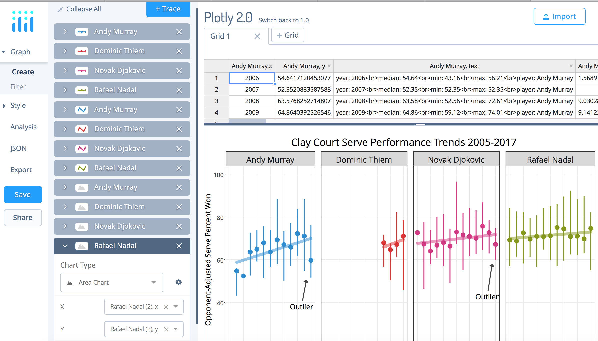


---

# Plotly Embed

Under the `Share` link you can also find the code that you can use to embed your final plot in your R Markdown file.

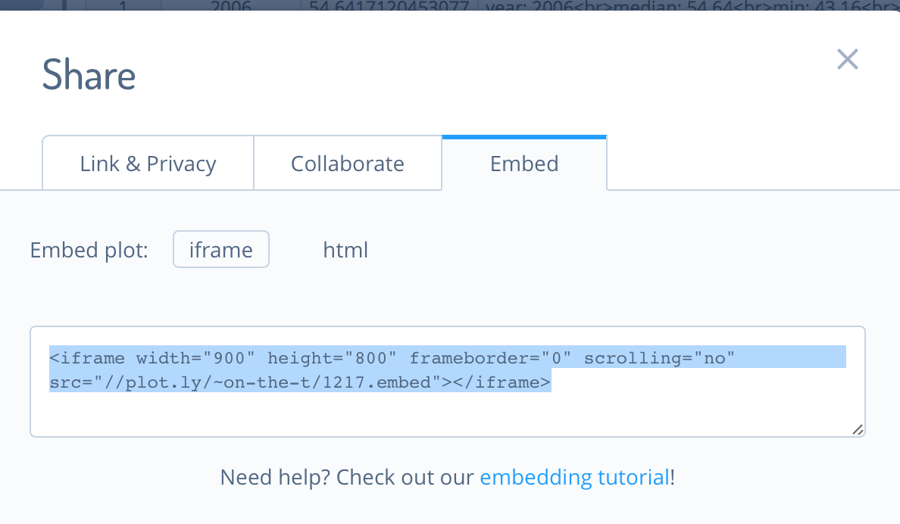

---

# Summary

<br>

--

- With `blogdown` and `Hugo` we can build a blog site and create new posts with `R` markdown

--

- Interactive charts can be created with `ggplot` and `plotly` and embedded in our posts with an HTML `iframe`


---

# Resources

- [blogdown](https://bookdown.org/yihui/blogdown/)

- [plotly](https://plot.ly/r/getting-started/)

- [Git Commands](https://confluence.atlassian.com/bitbucketserver/basic-git-commands-776639767.html)


---

class: center

<br>


