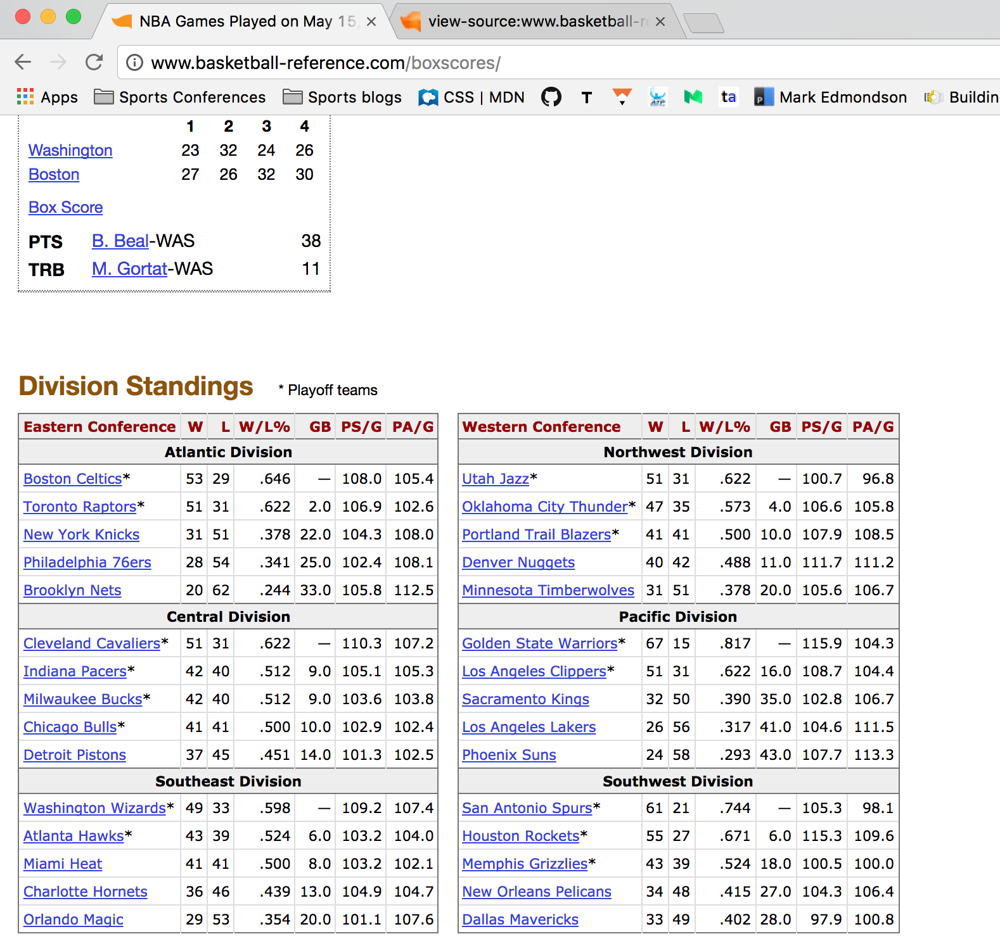
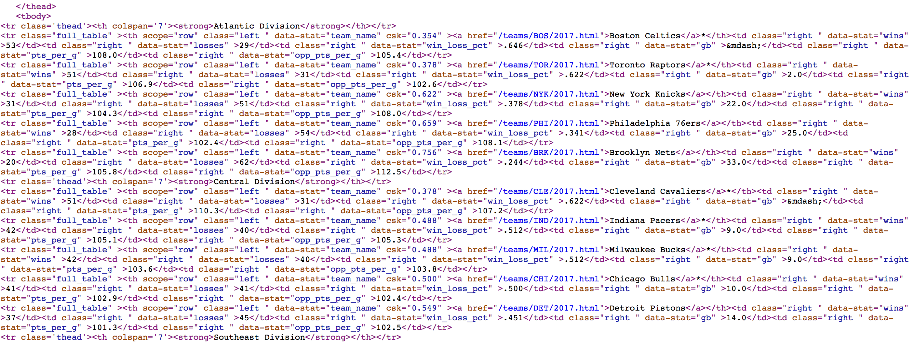
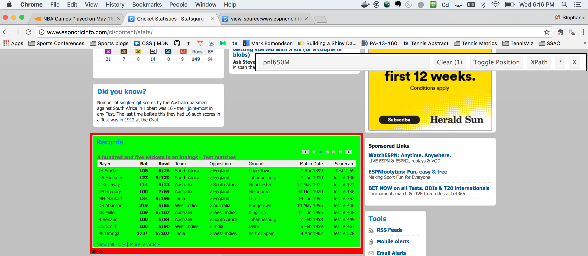
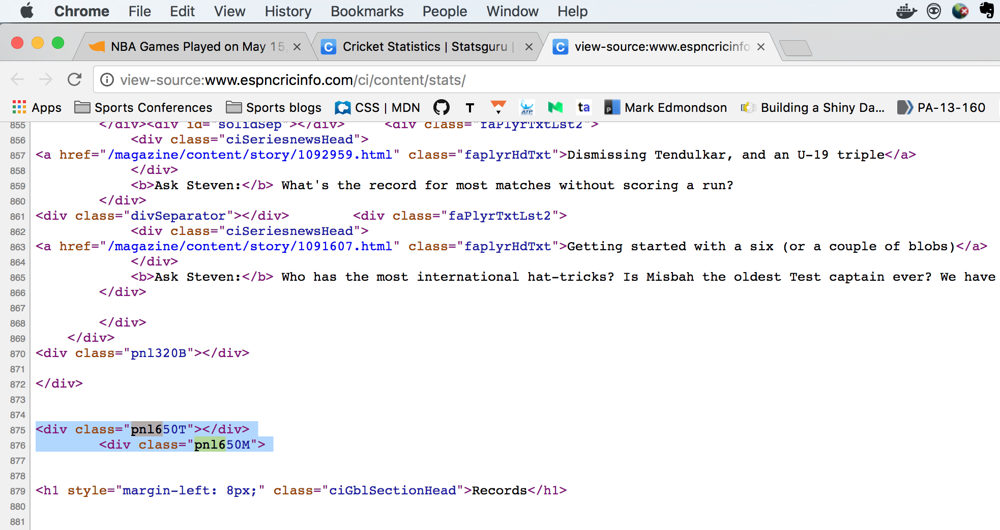

```{r setup, include = FALSE, message = FALSE}
options(htmltools.dir.version = FALSE)

library(RSelenium)
library(htmlTable)
```

class: slide-img

# Ways of Getting Sports Data

If you need to gather sports data from the Web yourself, some common ways of importing the data into R include:

--

- Importing a data file directly from a Website

--

- Scraping from the underlying source code, which can come in two basic flavors:

  1. Extraction from HTML for static data
  
  2. Extraction through automated browsing for data that is generated dynamically

---

class: slide-img

# Import Data File

--

- Some sites, like [Baseball-Reference.com](http://www.baseball-reference.com), provide tools for creating exportable reports.

--

- In general, we want to avoid manual data collection and automate wherever possible because: *automation = efficiency*

--

- Sports data that is on the Web as an importable file can be imported with `read.table` or similar import function in R if we can determine it's URL

---

class: slide-img

# Import Data File

- What are "importable" files? 

--

- Common types include:

--

  - txt
  - csv
  - xls
  - Anything else you can read with `read.table` or specialty imports
  

---

class: slide-img

# Example: Import Data File

Here we extract the most recent Australian Open match results and betting odds using `read.csv`.

```{r eval = FALSE}
url <- "http://www.tennis-data.co.uk/2017/ausopen.csv"

read.csv(url)
```

---

class: slide-img

# Practice: Import Data File

How do you think you would obtain the same data from the last US Open? 

--

1. Give it a try.

2. Read in the data.

3. Determine the number of matches included.

---

class: slide-img

# Solution: Import Data File


```{r}
url <- "http://www.tennis-data.co.uk/2016/usopen.csv"

usopen <- read.csv(url)

nrow(usopen) # Number of matches
```

---

class: slide-img

# Web Scraping

.cbox[
More often you will need to go "under the hood" and work directly with HTML/CSS to extract data from Websites.
]

---

class: slide-img

# Inspecting Web Pages


- Before you can extract the data, you need to understand the site design and how the data is contained in it

--

- This means getting familiar with "View Source"

--

- I would recommend getting the "Developer" add-in with Google Chrome, which has an array of tools for inspecting the contents of Web Sites

---

class: slide-img

# Viewing Source in Chrome


---

class: slide-img

# Static vs Dynamic Data

.cbox[
Understanding which tools you need to extract data from a Web site starts with determining if the data is _statically_ or _dynamically_ generated on the site.
]

<br>

Web data is _static_ if you can see it in the source code.


---

# Example: Static Data

Consider these NBA box scores from [Basketball Reference](http://www.basketball-reference.com/):




---

# Example: Static Data

When we look at the source, we find an HTML table of the same information, confirming that this is static Web data.



---

# Selector Gadget

* You can make navigating a Web page even easier by using the [Selector Gadget](http://selectorgadget.com/)

* This is a free extension for Google Chrome

* When turned on, you can highlight parts of a site and get information about the underlying CSS tags associated with those elements 


---

class: slide-img

# Scraping Static Data

There are a few options for extracting static HTML data.

1. `readLines` is an option if the data is _not_ nicely formatted, in other words, when there is a lack of structure

2. More typically, the data is _nice_ (e.g. if it is contained in a HTML table or other predictable tag) and we can use scraping packages like `rvest` or `RCurl` to get the data in a format we can work with.

---

class: slide-img

# Using `rvest`

--

- Suite of tools for scraping static Web data and putting them in easy-to-use objects (like data.frames)

--

- Works with `magrittr` and allows piping commands with `%>%` operator

--

- Allows some browsing functionality

--

- Authored by Hadley Wickham

---

class: slide-img

# Example: Scraping Box Scores

In this example, we will use `rvest` to extract the Eastern Division Standings.

First, we import the page content.

```{r message = FALSE}
library('rvest')

# Creating object with the address
url <- 'http://www.basketball-reference.com/boxscores/'

#Reading the code from the site
webpage <- read_html(url)
```

---

class: slide-img

# Example: Scraping Box Scores

The `html_nodes` function is the work horse function for extracting specific elements of a site. We can specify the element we want using its CSS tag or using an XPATH selector.

```{r}
# Using the CSS table tag to get all tables
data <- webpage %>%
   html_nodes(css = 'table') %>%
   html_table()

length(data) # List of multiple tables
```


---

class: slide-img

# Example: Scraping Box Scores

Using an XPATH ([XML Path Language](https://en.wikipedia.org/wiki/XPath)) can help to make our extraction more specific, though the syntax is more opaque. 

```{r}
# Using an XPATH selector to get the specific table of interest
data <- webpage %>%
   html_nodes(xpath = '//*[@id="divs_standings_E"]') %>%
   html_table(header = T)

head(data[[1]])
```


---

class: slide-img

# Practice: Static Data Extraction

The following site lists the Elo ratings of professional male tennis players: [Tennis Abstract Elo](http://tennisabstract.com/reports/atp_elo_ratings.html)

--

1. Use your Web inspection tools to determine if the ratings are static data

2. Use `rvest` to scrape the data as efficiently as you can

---


class: slide-img

# Solution: Elo Rating Extraction


---


class: slide-img

# Solution: Elo Rating Extraction

```{r}
url <- "http://tennisabstract.com/reports/atp_elo_ratings.html"

page <- read_html(url)

# Use table class to extract Elo table
elo <- page %>%
    html_nodes("table.tablesorter") %>%
    html_table()

head(elo)
```

---

class: slide-img

# Identifying Dynamic Data

.cbox[
_Dynamic_ data is generated as you browse (through javascript functions, for example) and is not directly accessible in the HTML.
]

<br>

It may still be possible to extract these data but it will require automated browsing to do so.

---


# Example: Dynamic Data


Consider this table of records from the [ESPN Cricket Info](http://www.espncricinfo.com/ci/content/stats/) site.



---

# Example: Dynamic Data

When we look up the CSS element, we see that there is no data there. 

What we have here is an example of dynamically-generated data.



---

class: slide-img

# Automated Browsing

--

- Because dynamic data is created on-the-fly (in response to user interactions) we have to browse to get access to it

--

- Fortunately, we can automate browsing 

--

- We just need to find what instructions to give to mimic the browsing that generates the data and get familiar with tools that can implement these instructions


---

class: slide-img

# RSelenium

--

- _Selenium_ is software that allows automated Web browsing

--

- [RSelenium](https://cran.r-project.org/web/packages/RSelenium/index.html) is a package that provides Selenium functionality in R


---

class: slide-img

# RSelenium: Basic Steps

1. Set the Web driver (select browser and port)

2. Find the elements with the data

3. Extract the content

4. Parse the contents

---

class: slide-img

# Example: Tennis Match Statistics

Consider the following match summary: [2017 Australian Open Final](http://www.flashscore.com/match/Cj6I5iL9/#match-statistics;0)


---


class: slide-img

# Example: Tennis Match Statistics

If we inspect the page, we find that these stats are dynamic data. We also find that the main table of content has the id `detail`.


---

# Using RSelenium

Below we activate the driver using a port that is not in use. 

*Note:* You may need to activate javascript in the background for this driver to work.

```{r, message = FALSE, eval = FALSE}
library(RSelenium) # Load the package

# Match statistics URL
url <- "http://www.flashscore.com/match/Cj6I5iL9/#match-statistics;0"

# Establish remote driver using Chrome
remDr <-remoteDriver(port = 5556, browser = "chrome")
remDr$open(silent = TRUE)
remDr$navigate(url) # Navigate page
```

---

# Using RSelenium

Next we extract the table of stats using the CSS `id` node.

```{r eval = FALSE}
# Get id element
webElem <- remDr$findElements(using = 'id', "detail")

#  Use getElementText to extract the text from this element
unlist(lapply(webElem, function(x){x$getElementText()}))[[1]]

remDr$close() # Close driver when finished
```

---

# Practice: RSelenium

Take a look at the following match summary that you can find [here](http://www.atpworldtour.com/en/players/novak-djokovic/D643/overview/match-stats/416/2017/Z355/match-stats).


<div>

</div>


---

class: slide-img

# Practice: RSelenium

Use what we've covered about `RSelenium` to extract the statistics for this match.

1. Start by inspecting the Web site

2. Determine which CSS element is most likely to contain the stats

3. Create a remote driver, navigate to that element, and check if the text for the match statistics are contained in the element

---


class: slide-img

# Solution: RSelenium

Inspection of the source code suggests that the Element with id *modalScoresMatchStatsTable* is likely to contain the statistics.


---


class: slide-img

# Solution: RSelenium

Now we navigate to the site.

```{r, message = FALSE}
# Match statistics URL
url <- "http://www.atpworldtour.com/en/players/novak-djokovic/D643/overview/match-stats/416/2017/Z355/match-stats"

# Establish remote driver using Chrome
remDr <-remoteDriver(port = 5556, browser = "chrome")
remDr$open(silent = TRUE)
remDr$navigate(url) # Navigate page
```

---

class: slide-img

# Solution: RSelenium

Then we find the `id` element of interest and extract the text it contains.

```{r, tidy=TRUE, tidy.opts=list(width.cutoff=30)}
# Get id element
webElem <- remDr$findElements(using = 'id', "modalScoresMatchStatsTable")

#  Use getElementText to extract the text from this element
unlist(lapply(webElem, function(x){x$getElementText()}))[[1]]
```

```{r echo = FALSE}
remDr$close() # Close driver when finished
```

---

class: slide-img

# Summary

- Web data can be classed into three main categories: directly importable, static, or dynamic

- We can use source inspection and CSS selector tools to determine which data type we are working with and the site elements that contain the data

- We have seen how we use tools like `rvest` to capture static Web data

- For dynamic data, we can use automated browsing with `RSelenium` 

---

class: slide-img

# Resources

- [CSS and HTML crash course](http://flukeout.github.io/)

- [XPATH](https://www.w3schools.com/xml/xpath_intro.asp)

- [rvest](https://www.r-bloggers.com/rvest-easy-web-scraping-with-r/)

- [RSelenium](https://ropensci.org/tutorials/rselenium_tutorial.html)
