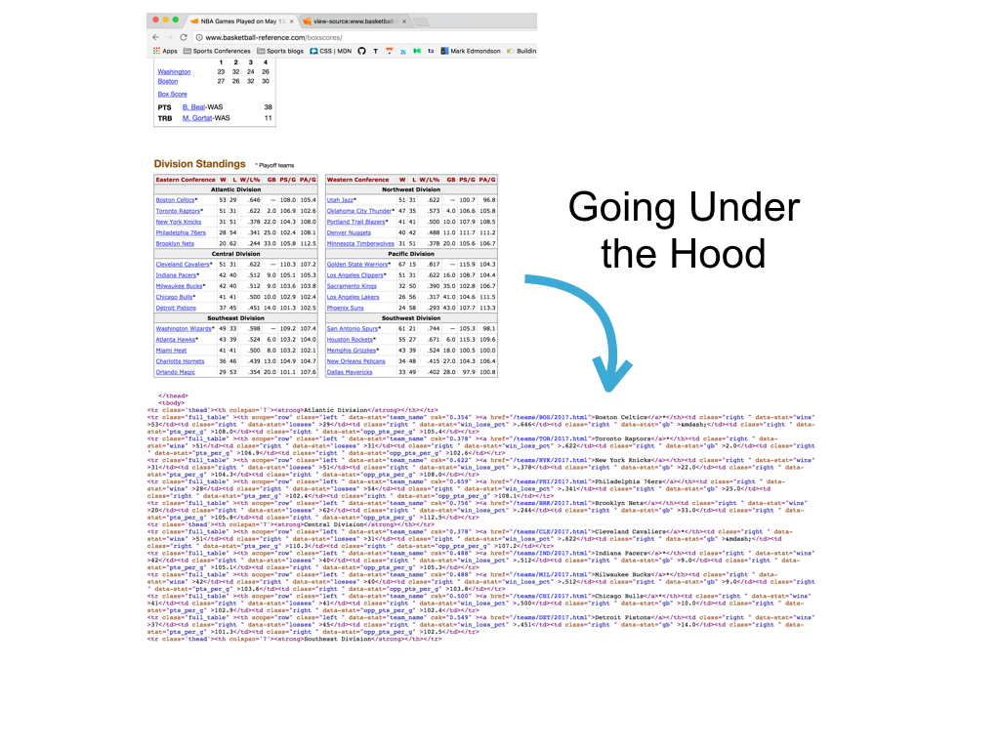
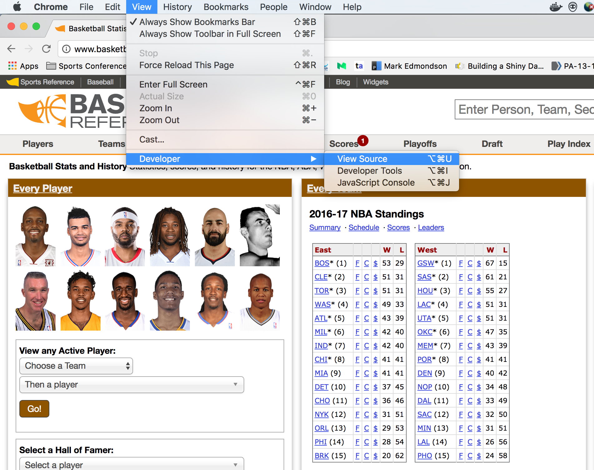
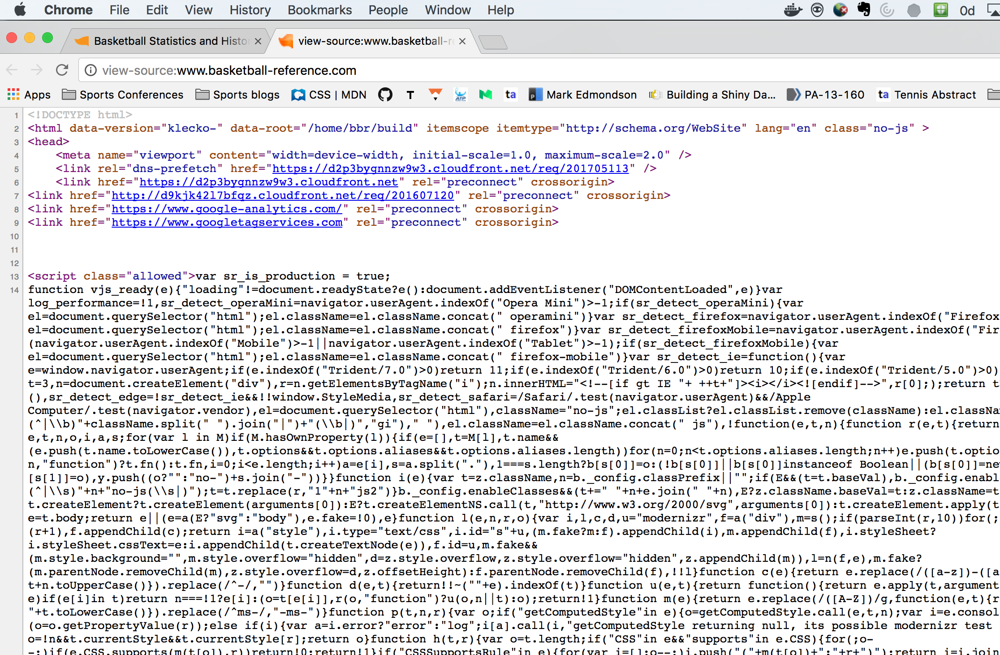
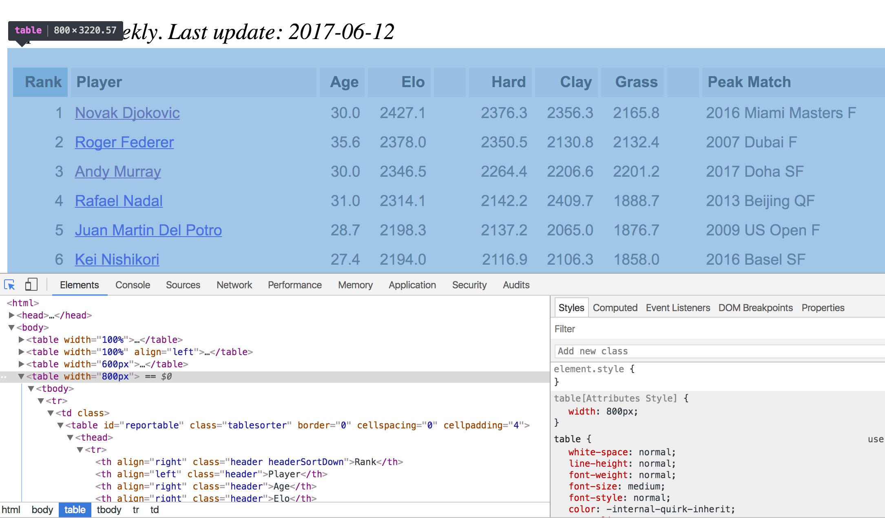
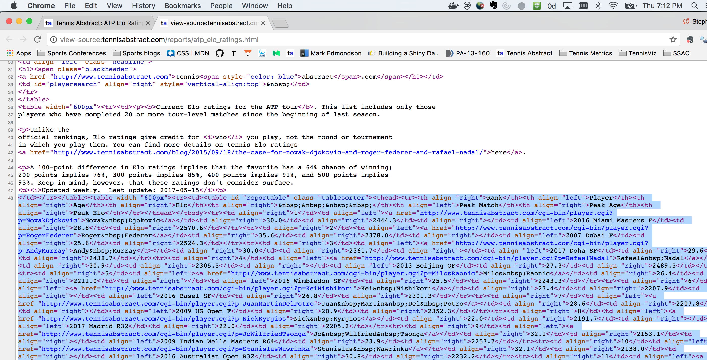
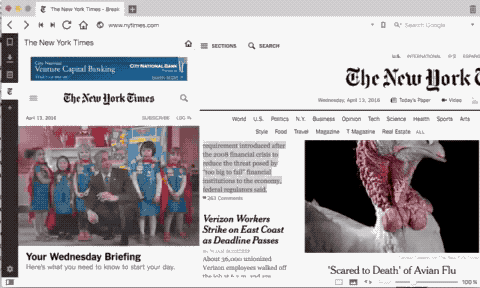
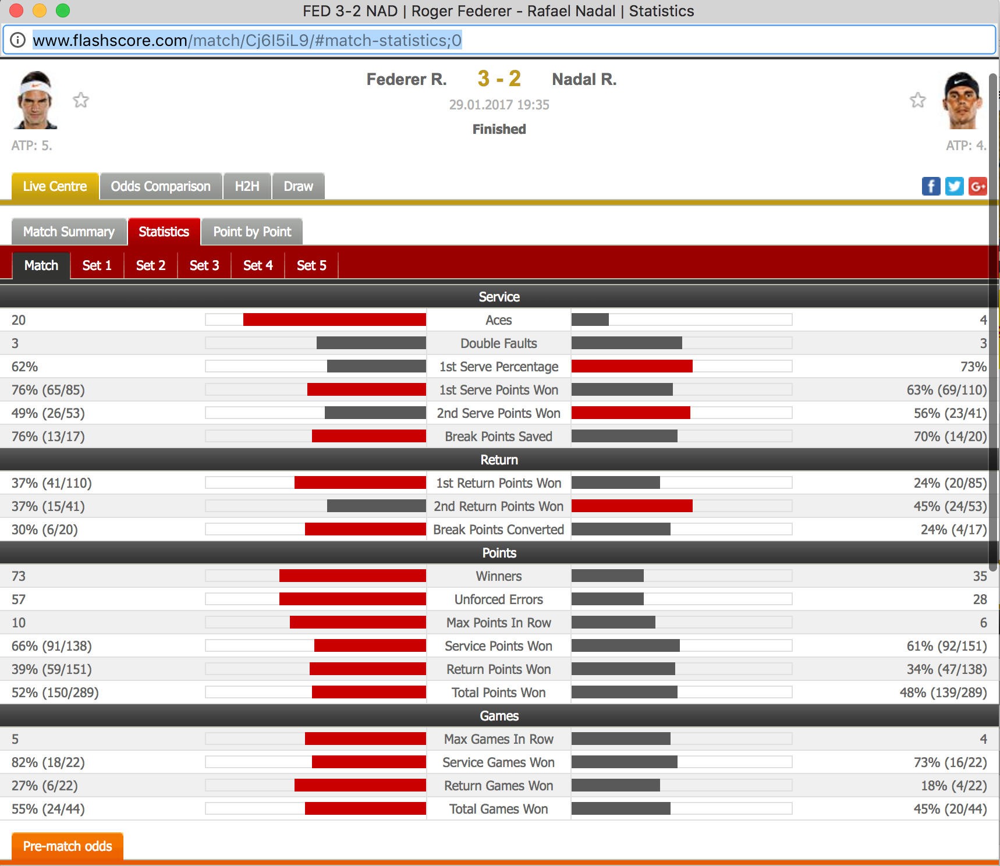
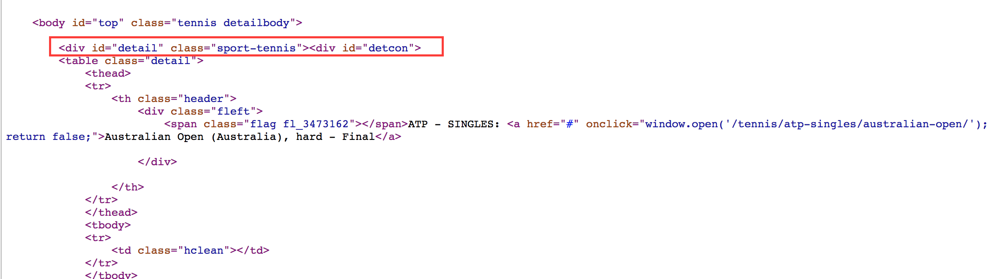
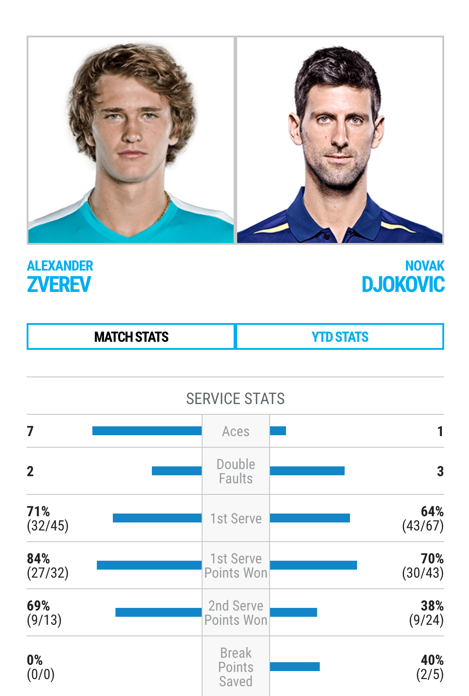
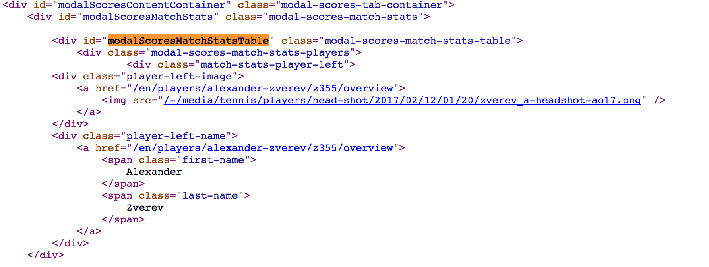

```{r setup, include = FALSE, message = FALSE}
options(htmltools.dir.version = FALSE)

library(RSelenium)
library(htmlTable)
```

class: slide-img

# What Next?

If you've found the data you want on the Web, what comes next?

<div align="center">

</div>

--

If you want to capture these or similar data repeatedly, you will want to retrieve it in a reproducible way.

---

class: slide-img

# Ways of Getting Sports Data

.left[
- Not always fun but a necessary part of sports analysis

- There are two major ways to get data from Web:

  1. Import a file directly

  2. Extract from HTML
] 

.right[

]

---

class: slide-img

# Example: Import Data File

- Files that can be read with `read.table` or related functions can be directly imported from a URL. 

- Here we extract the most recent Australian Open match results and betting odds using `read.csv`.

<br>

```{r eval = FALSE}
url <- "http://www.tennis-data.co.uk/2017/ausopen.csv"

read.csv(url)
```

---

class: slide-img

# Practice: URL Patterns & Importing

Consider the previous example. If we wanted the same data for the 2016 US Open, how do you think we could do that?

--

1. Test a possible URL for the 2016 US Open

2. Import the file

3. Run a `str` on the dataset to determine what info it contains


---

class: slide-img

# Solution: URL Patterns & Importing

Changing the year and tournament names in the URL are enough to get the correct file.

```{r}
url <- "http://www.tennis-data.co.uk/2016/usopen.csv"

usopen <- read.csv(url)
```

<br>

When we look at the variables, we find it contains the scores and betting odds for all 127 main draw matches for the US Open.

```{r eval = F}
str(usopen) # Data contents
```

---

class: slide-img

# Scraping from a Website

If you can't directly import data from the Web--which is usually the case--you can still capture the data but you need to know whether it is *static* or *dynamic* data. 

<br>

--

What is *static* data? 

What is *dyanmic* data? 

And how do you determine which type of data you have?

---

class: slide-img

# Static vs. Dynamic Data

We use different methods to get Web data depending on which type it is, so it is very important to be able to identify each type.

.left[

]

.right[
* _Static_ web data is data you can see in the source code.

* If you can't see the data, the data is _dynamic_.
]

---

class: slide-img

# How Do I Know if Data is Static or Dynamic?

.left[
- You need to be able to inspect HTML and CSS

- This means being able to "View Source"

- Being able to identify CSS elements in source.
]

.right[
<div align="center">

</div>
]


---

class: slide-img

# Web Developer Tools

Every modern browser has a suite of "developer tools". These include useful functions for Web scrapers, including:

1. Viewing the source code

2. Inspecting elements

--

<br>

I personally like Chrome's suite of Developer Tools.

---


class: slide-img

# Viewing Source in Chrome






---

class: slide-img

# Practice: Static or Dynamic?

Look at the source code for each of the following sites and determine whether they are examples of _static_ or _dynamic_ data.

<br>

Case 1. [http://tennisabstract.com/reports/atp_elo_ratings.html](http://tennisabstract.com/reports/atp_elo_ratings.html)

Case 2. [http://www.espncricinfo.com/ci/content/stats/](http://www.espncricinfo.com/ci/content/stats/)


---

class: slide-img

# Solution: Static or Dynamic?


Case 1 is static data.

Case 2 is dynamic data.

---

class: slide-img

# Finding Elements

* Whether you are working with static of dynamic data you need to be able to locate the elements that contain your data

* It is the information about this element which you will need to automate data capture


* CSS `class` and `id` fields are the most common ways to uniquely identify the element containing your data


---

class: slide-img

# Practice: Inspect Element

Use the following static data example:  [http://tennisabstract.com/reports/atp_elo_ratings.html](http://tennisabstract.com/reports/atp_elo_ratings.html)

1. Find the CSS class or id that contains the Elo ratings data

---

class: slide-img

# Solution: Inspect Element

Here, I use the "inspect element" settings from Chrome's developer tools to learn about the CSS of the table containing the Elo ratings.




---

class: slide-img

# Solution: Inspect Element

<br>

* The CSS **class** for the table is "tablesorter" 

* The CSS **id** is "reportable"

---

class: slide-img

# Scraping Static Data

There are a few options for extracting static HTML data.

1. `readLines` is an option if the data is _not_ nicely formatted, in other words, when there is a lack of structure

2. More typically, the data is _nice_ (e.g. if it is contained in a HTML table or other predictable tag) and we can use scraping packages like `rvest` or `RCurl` to get the data in a format we can work with.

---

class: slide-img

# Using `rvest`

--

- Suite of tools for scraping static Web data and putting them in easy-to-use objects (like data.frames)

--

- Works with `magrittr` and allows piping commands with `%>%` operator

--

- Allows some browsing functionality

--

- Authored by Hadley Wickham

---

class: slide-img

# Example: Scraping Box Scores

In this example, we will use `rvest` to extract the Eastern Division Standings.

First, we import the page content.

```{r message = FALSE}
library('rvest')

# Creating object with the address
url <- 'http://www.basketball-reference.com/boxscores/'

#Reading the code from the site
webpage <- read_html(url)
```

---

class: slide-img

# Example: Scraping Box Scores

The `html_nodes` function is the work horse function for extracting specific elements of a site. We can specify the element we want using its CSS tag or using an XPATH selector.

```{r}
# Using the CSS table tag to get all tables
data <- webpage %>%
   html_nodes(css = 'table') %>%
   html_table()

length(data) # List of multiple tables
```


---

class: slide-img

# Example: Scraping Box Scores

Using an XPATH ([XML Path Language](https://en.wikipedia.org/wiki/XPath)) can help to make our extraction more specific, though the syntax is more opaque. 

```{r}
# Using an XPATH selector to get the specific table of interest
data <- webpage %>%
   html_nodes(xpath = '//*[@id="divs_standings_E"]') %>%
   html_table(header = T)

head(data[[1]])
```


---

class: slide-img

# Practice: Static Data Extraction

The following site lists the Elo ratings of professional male tennis players: [Tennis Abstract Elo](http://tennisabstract.com/reports/atp_elo_ratings.html)

--

1. Use your Web inspection tools to determine if the ratings are static data

2. Use `rvest` to scrape the data as efficiently as you can

.footnote[
[1] For a 'table' with class 'x' you can use 'table.x' as a shortcut 
]

---


class: slide-img

# Solution: Elo Rating Extraction



---


class: slide-img

# Solution: Elo Rating Extraction

```{r}
url <- "http://tennisabstract.com/reports/atp_elo_ratings.html"

page <- read_html(url)

# Use table class to extract Elo table
elo <- page %>%
    html_nodes("table.tablesorter") %>%
    html_table()

head(elo)
```

---

class: slide-img

# Dynamic Data & Automated Browsing

--

- Because dynamic data is created on-the-fly (in response to user interactions) we have to browse to get access to it

--

- Fortunately, we can automate browsing 

--

- We just need to find what instructions to give to mimic the browsing that generates the data and get familiar with tools that can implement these instructions


---


class: slide-img

# Scraping Dynamic Data with `RSelenium`

.left[

- We have to automate Web browsing to get dynamic data


- _Selenium_ is software that allows automated Web browsing

- [RSelenium](https://cran.r-project.org/web/packages/RSelenium/index.html) is a package that provides Selenium functionality in R
]

.right[
<div align="center">

</div>
]


---

class: slide-img

# RSelenium: Basic Steps

1. Set the Web driver (select browser and port)

2. Find the elements with the data

3. Extract the content

4. Parse the contents

---

class: slide-img

# Installing RSelenium

There are a few steps you need to get started with RSelenium.

<br>

1. Install a Selenium server which is a standalone java program and can be downloaded here:[selenium-release.storage.googleapis.com](http://selenium-release.storage.googleapis.com/index.html)

2. Run the Selenium server with the command: `java -jar selenium-server-standalone-x.xx.x.jar` where the `x.xx.x` will be the specific version (Default port is 4444)

3. Install RSelenium from CRAN


---

class: slide-img

# Example: Tennis Match Statistics

Consider the following match summary: [2017 Australian Open Final](http://www.flashscore.com/match/Cj6I5iL9/#match-statistics;0)




---


class: slide-img

# Example: Tennis Match Statistics

If we inspect the page, we find that these stats are dynamic data. We also find that the main table of content has the id `detail`.




---

# Using RSelenium

Below we activate the driver using a port that is not in use. 

*Note:* You may need to activate javascript in the background for this driver to work.

```{r, message = FALSE, eval = FALSE}
# Running java -Dwebdriver.chrome.driver="chromedriver" -jar selenium-server-standalone.jar -port 5556 

library(RSelenium) # Load the package

# Match statistics URL
url <- "http://www.flashscore.com/match/Cj6I5iL9/#match-statistics;0"

# Establish remote driver using Chrome
remDr <-remoteDriver(port = 5556, browser = "chrome")
remDr$open(silent = TRUE)
remDr$navigate(url) # Navigate page
```

---

# Using RSelenium

Next we extract the table of stats using the CSS `id` node.

```{r eval = FALSE}
# Get id element
webElem <- remDr$findElements(using = 'id', "detail")

#  Use getElementText to extract the text from this element
unlist(lapply(webElem, function(x){x$getElementText()}))[[1]]

remDr$close() # Close driver when finished
```

---

# Practice: RSelenium

Take a look at the following match summary that you can find [here](http://www.atpworldtour.com/en/players/novak-djokovic/D643/overview/match-stats/416/2017/Z355/match-stats).


<div>

</div>


---

class: slide-img

# Practice: RSelenium

Use what we've covered about `RSelenium` to extract the statistics for this match.

1. Start by inspecting the Web site

2. Determine which CSS element is most likely to contain the stats

3. Create a remote driver, navigate to that element, and check if the text for the match statistics are contained in the element

---


class: slide-img

# Solution: RSelenium

Inspection of the source code suggests that the Element with id *modalScoresMatchStatsTable* is likely to contain the statistics.




---


class: slide-img

# Solution: RSelenium

Now we navigate to the site.

```{r, message = FALSE}
# Match statistics URL
url <- "http://www.atpworldtour.com/en/players/novak-djokovic/D643/overview/match-stats/416/2017/Z355/match-stats"

# Establish remote driver using Chrome
remDr <- remoteDriver(port = 5556, browser = "chrome")
remDr$open(silent = TRUE)
remDr$navigate(url) # Navigate page
```

---

class: slide-img

# Solution: RSelenium

Then we find the `id` element of interest and extract the text it contains.

```{r, tidy=TRUE, tidy.opts=list(width.cutoff=30)}
# Get id element
webElem <- remDr$findElements(using = 'id', "modalScoresMatchStatsTable")

#  Use getElementText to extract the text from this element
unlist(lapply(webElem, function(x){x$getElementText()}))[[1]]
```

```{r echo = FALSE}
remDr$close() # Close driver when finished
```

---

class: slide-img

# Summary

- Web data can be classed into three main categories: directly importable, static, or dynamic

- We can use source inspection and CSS selector tools to determine which data type we are working with and the site elements that contain the data

- We have seen how we use tools like `rvest` to capture static Web data

- For dynamic data, we can use automated browsing with `RSelenium` 

---

class: slide-img

# Resources

- [CSS and HTML crash course](http://flukeout.github.io/)

- [XPATH](https://www.w3schools.com/xml/xpath_intro.asp)

- [rvest](https://www.r-bloggers.com/rvest-easy-web-scraping-with-r/)

- [RSelenium](https://ropensci.org/tutorials/rselenium_tutorial.html)
