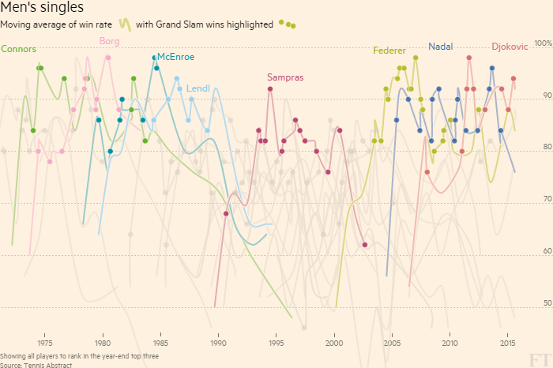
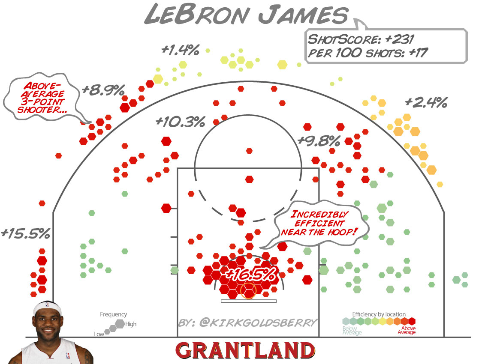
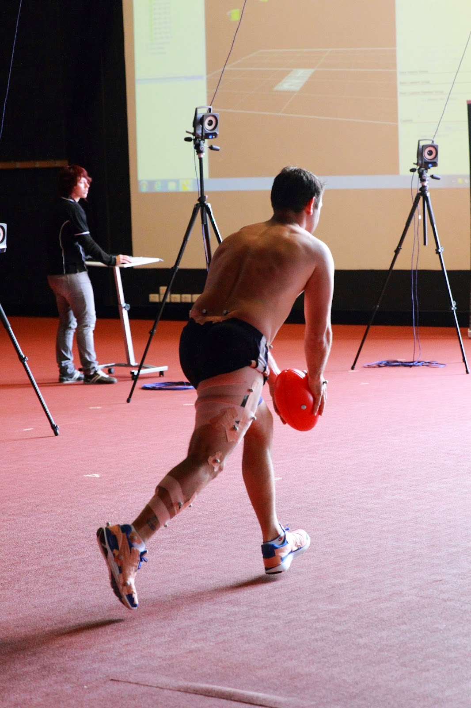
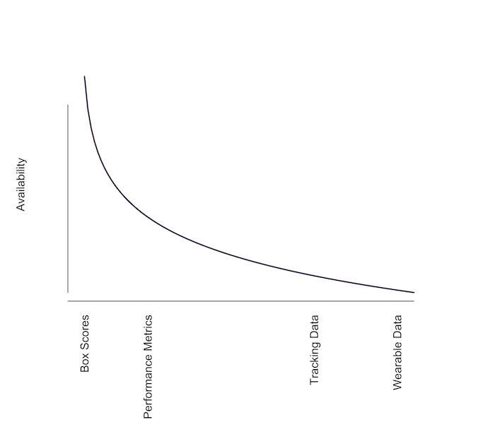
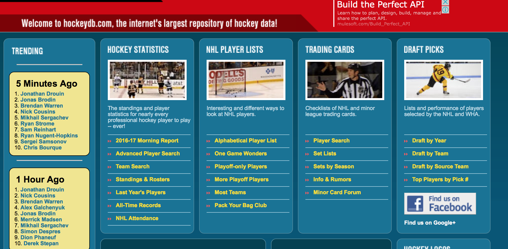
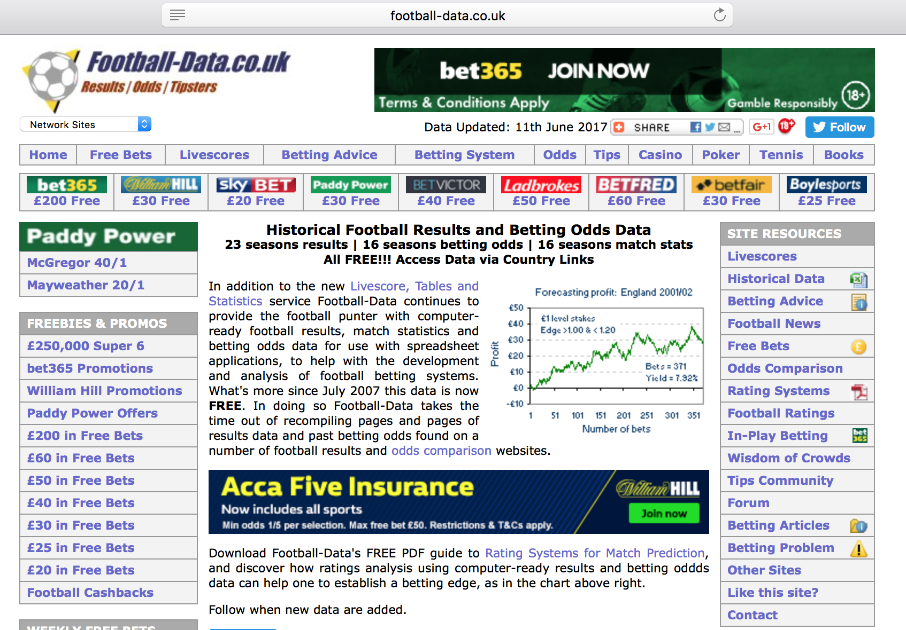

```{r setup, include = FALSE}
options(htmltools.dir.version = FALSE)
library(htmlTable)
```

# About Me

- ISEAL Research Fellow at Victoria University

- Principal Data Scientist for Tennis Australia's Game Insight Group

- Tennis Blog: [on-the-t.com](http://on-the-t.com)

- @StatsOnTheT

<div align="center">

</div>

---

# Tutorial Resources

- Course package: [deuce](https://github.com/skoval/deuce)

- Course tutorial: [UseRSportTutorial](https://github.com/skoval/UseRSportTutorial)

- Contact: [s.a.kovalchik@gmail.com](s.a.kovalchik@gmail.com)

---


# What It's Like to Be a Sports Statistician

.left[
- Finding sports data

- Web scraping sports data

- Data wrangling

- Exploratory data analysis

- Predictive modelling

- Blogging
]

.right[

]

---


.hbox[
## Finding Sports Data
]

---


class: slide-img

# Popular Types of Sports Data

- Box Scores

- Performance Metrics

- Tracking Data

- Wearable Data

---

class: slide-img

# Box Scores

A 'box score' is a generic term for the summary statistics reported about a single sporting event.

<div align="center">

</div>

.footnote[
[1] Baseball box score from 1876.
]

---

class: slide-img

# Performance Metrics

Performance metrics are usually repeated measures of team or players that are derived from historical box scores. 

<br>

<div align="center">

</div>

---

class: slide-img

# Tracking Data

'Tracking data' is spatio-temporal data of objects in a sporting event.

<br>

<div align="center">

</div>


---

class: slide-img

# Wearables

.left[
- 'Wearables' are technologies that collect data about athletes when worn. 

- Biometrics and movement are two common types of data collected.
]

.right[
<div align="center">

</div>
]

.footnote[
[1] VU Biomechanics Lab
]

---

class: slide-img

# Data Availability Curve

Sadly, not all types of sports data are equally available though the steepness of the curve depends on the particular sport.

<div align="center">

</div>

---

class: slide-img

.left[
```{r echo = F}
data <- data.frame(
  Category = c("<b>Multiple</b>", rep("", 3),
               "<b>American Football</b>", rep("", 5),
               "<b>Baseball</b>", rep("", 17),
               "<b>Basketball</b>", rep("", 12)),
  URL = c(
    "www.databaseSports.com",
    "www.opensourcesports.com",
    "http://www.espn.com.au/blog/statsinfo",
    "http://www.masseyratings.com/data.php",
    "http://www.bballsports.com/",
    "http://www.cfbstats.com/blog/college-football-data/",
    "http://www.databaseFootball.com/",
    "http://www.nfl.com/stats/player",
    "http://www.pro-football-reference.com",
    "http://stats.washingtonpost.com/cbk/teams.asp",
    "http://www.baseball-almanac.com/teamstats/statmaster.php",
    "http://www.baseballamerica.com/statistics/",
  "http://www.baseballheatmaps.com/graph/distanceleader.php",
  "http://www.baseballmusings.com/cgi-bin/DayByDayDatabase.py",
  "http://www.baseballprospectus.com/sortable/",
  "http://www.baseball-reference.com",
  "http://baseballguru.com/battingdatabase.html",
  "http://www.bballsports.com/",
  "http://www.databasebaseball.com",
  "http://www.dougstats.com/",
  "http://www.fangraphs.com/",
  "http://www.hittrackeronline.com/index.php",
  "http://www.baseball-links.com/",
  "http://www.retrosheet.org",
  "http://www.sabr.org/",
  "http://www.seanlahman.com/",
  "http://www.statcorner.com/",
  "http://www.thebaseballcube.com/",
  "http://www.82games.com/",
  "http://www.apbr.org/",
  "http://www.basketball-reference.com/",
  "http://www.basketballvalue.com/",
  "http://www.bballsports.com/",
  "http://www.nba.com/statistics/index.html",
  "http://www.databasebasketball.com/",
  "http://www.dougstats.com/",
  "http://www.finalfour.net/",
  "http://www.hoopdata.com/",
  "http://www.kenpom.com/",
  "http://www.ncaa.org/",
  "http://stats.washingtonpost.com/nba/"
  )
)

htmlTable(data, 
          rnames = F, 
          align = c("cl"),
          col.rgroup = 
           rep(c("#eeeeee", "#e5f7f7", "#eeeeee", "#e5f7f7"), c(4, 6, 18, 13)),
          css.cell = "font-size:11px;",
          css.table = "margin-left:-1em; margin-bottom:1em;")
```
]

.right[
```{r echo = F}
data <- data.frame(
  Category = c(
               "<b>Hockey</b>", rep("", 9),
               "<b>Soccer</b>", rep("", 7),
               "<b>Other</b>", rep("", 9)),
  URL = c(

  "https://puckalytics.com",
  "http://www.bballsports.com/",
  "http://www.databasehockey.com/",
  "http://stats.hockeyanalysis.com/",
  "http://www.hockey-reference.com/",
  "http://www.hockeydb.com/",
  "http://www.nhlpa.com/stats/league-wide",
  "http://www.nhl.com/ice/statshome.htm",
  "http://www.quanthockey.com/",
  "http://stats.washingtonpost.com/nhl/teams.asp",    
  "http://www.football-data.co.uk/",
  "http://www.football-data.co.uk/data.php",
  "http://soccerway.com",
  "http://www.squawka.com/",
  "http://www.statto.com/football/stats",
  "http://www.transfermarkt.com/",
  "http://www.whoscored.com/",
  "http://www.worldcup.com/",
  "http://www.uci.ch/",
  "http://www.espncricinfo.com/",
  "http://www.databasegolf.com/",
  "http://www.tennisabstract.com/",
  "http://www.databaseSports.com/olympics",
  "http://www.rugbydata.com/",
  "http://www.afl.com.au/stats",
  "http://www.volleyball.org/",
  "http://www.databaseracing.com/",
  "http://games.crossfit.com/leaderboard"
  )
)

htmlTable(data, 
          rnames = F, 
          align = c("cl"),
          col.rgroup = 
            rep(c("#eeeeee", "#e5f7f7", "#eeeeee"), c(10, 8, 10)),
          css.cell = "font-size:11px;",
          css.table = "margin-left:4em; margin-bottom:1em;")
```
]

---

class: slide-img

# Case Studies

Navigating sports sites and finding where data lives can sometimes be tricky. Let's get some practice by inspecting the following sites. For each case, determine where the main data lives, what type is there, and in what format.

<br>

1. [http://www.hockeydb.com/](http://www.hockeydb.com/) 

2. [http://www.football-data.co.uk/data.php](http://www.football-data.co.uk/data.php) 

---

# Answer: Hockey Database

These data are under the 'Statistics' page and primarily exist as HTML tables.



---

# Answer: Football UK

A repository of betting data on soccer matches is available under the 'Historical Data' and these data are available as CSV files.



---

# Packages

```{r results = 'asis', echo = FALSE}
data <- data.frame(
  Sport = c("General", "", "", "Soccer", "Baseball", "", "Tennis", "Cricket"),
  Package = c("stattleshipR", "SportsAnalytics", "odds.converter",  "engsoccerdata", "pitchRx", "Lahman", "deuce", "cricketr!"),
  "What it Does" = c(
    "Data capture API for multiple sports",
    "Sports datasets and WEB import functions",
    "Convert odds to probabilities",
    "Repository of soccer datasets from 1871 to present",
    "Access to MLB Gameday data including pitchFX",
    "Sean Lahman baseball database",
    "Repository of multiple tennis datasets",
    "Functions for analyzing ESPN Cricinfo stats"
  )
)

cols <- c( "#fff", "#fff", "#fff", "#eeeeee", "#fff", "#fff", "#eeeeee", "#fff")

htmlTable(data, 
          rnames = F, 
          align = c("cll"),
          col.rgroup = cols,
          css.cell = "width:20%;")
```

---

# More on `deuce`

--

* `deuce` is a package I created to make it easy to access large historical data on tennis matches

--

* It combines data from multiple sites: 
  - [flashscore.com](www.flashscore.com)
  - [ATP Tour](http://atptour.com)
  - [WTA Tour](http://www.wtatennis.com)
  - [Tennis Abstract](www.tennisabstract.com)
  

--

* Some of the data you can obtain from `deuce` includes:

  - Match results from Open Era (1968) to the present

  - Historical rankings

  - Player demographics

  - Point-level data for multiple years at Grand Slams

  - Shot level data from the Match Charting Project
  
---

class: slide-img

# Installing `deuce`

You can install deuce using `devtools`. It may take several minutes because of the size of the datasets being transferred.

<br>

```{r eval = FALSE}
library(devtools)

devtools::install_github("skoval/deuce")
```

---

class: slide-img

# Using Documentation

One of the best ways to get familiar with what a package does is to look at the package index. Try the following:

```{r eval = FALSE}
library(deuce)

help(package = "deuce")
```

<br>

How would you learn about the contents of `atp_matches`?

--

```{r eval = FALSE}
help("atp_matches", package = "deuce")
```
