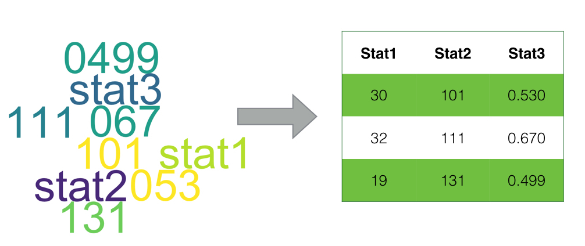
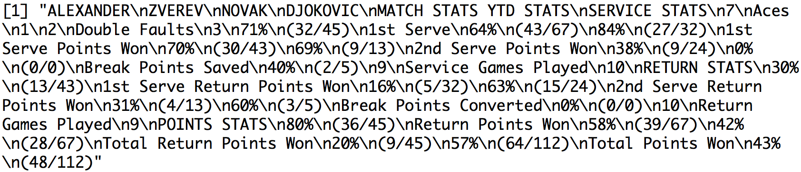
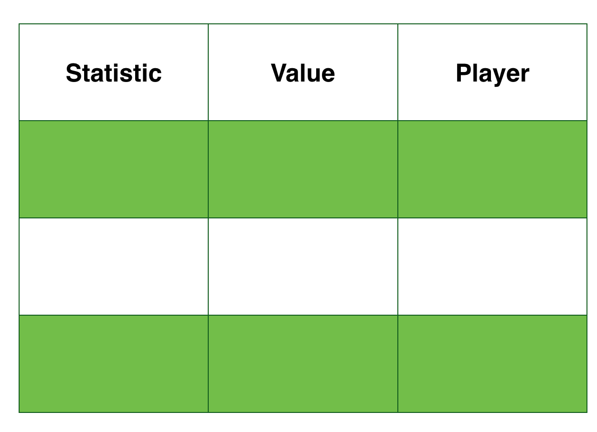
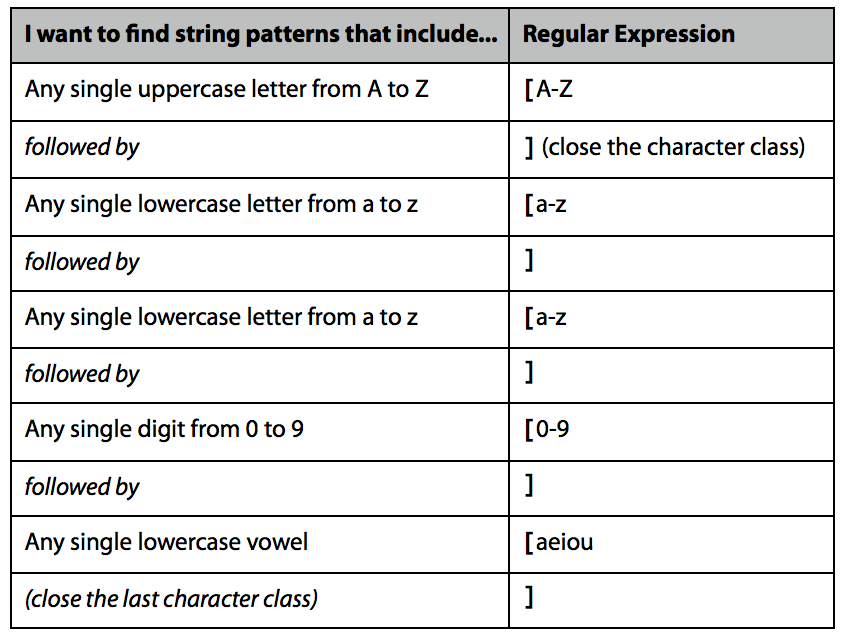
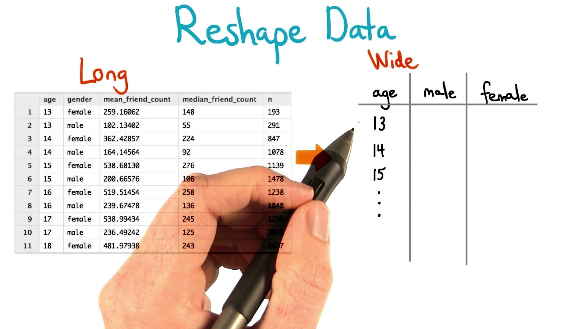

```{r setup, include = FALSE}
options(htmltools.dir.version = FALSE)

library(dplyr)
library(tidyr)
library(knitr)
library(htmlTable)
```

class: slide-img

# Data Wrangling

.cbox[
Data wrangling refers to the process of going from messy data to data that can be analyzed.
]

---

# Package WOMBATsport

* For the remainder of tutorial, we will be using data examples in the package `WOMBATsport`

* This is an `R` package that has been specially designed for this tutorial

* You can install is using the following:

<br>

```{r eval = FALSE}
library(devtools)

install_github("skoval/WOMBATsport")
````


---


class: slide-img

# Goal of Tidying 

When _tidying_ our goal is to end up with a row-by-column structure of our data, that has clearly named variables and valid values. 




---

class: slide-img

# Common Steps with Data Wrangling

- Tidying

- Reshaping

- Selecting

- Mutating

---

class: slide-img

# Tidying Unstructured Data 

--

- When scraping Web data, as we often do in sport, the data can be messy.

--

- It is typical to need some programming to get the data into a nice row by column structure

--

- String manipulation is a common task in this processed and can be tackled with the `stringr` package

---

# Example: Match Statistics

Recall the example from the Zverev v Djokovic tennis match that we pulled from the ATP site using `RSelenium`. The extracted data is in a single string, so it is unstructured and needs to be tidied up.

```{r echo = FALSE, message = FALSE}
library(WOMBATsport)

data(match_stats)
```

```{r eval = FALSE}
library(WOMBATsport)

data(match_stats) # load from WOMBATsport

match_stats
```




---

# What Steps Do We Need?

1. Identify the target structure (that is, variables and value types)

2. Split the string into the different variables

3. Extract values

4. Assign to variables in a data.frame

---

# Example: Goal Structure

We have a set of statistics for each player. One option is a long format with the following structure:


<br>

<div align="center">

</div>


---

# Example: Splitting

```{r}
library(stringr) # Load stingr

str_split(match_stats, "\n") # Split on return characters
```

---

# Group Data by Pattern

- Now that we have isolated some of the main elements of our data as a vector, we want to group data by type. 

- We can use pattern-matching to separate strings by their pattern

- Several useful `stringr` packages for pattern matching include:

--

<br>

```{r eval = FALSE}
str_detect(x, pattern) # Test each element for presence of pattern

str_subset(x, pattern) # Subset x by where pattern is found

str_extract(x, pattern) # Extracts first occurrence of pattern
```

---

# Regular Expressions

- By default, the `pattern` is assumed to be a _regular expression_.

- A *regular expression* describes a pattern in a string and is very powerful for pattern-finding. 

- Find more about `regex` in R [here](https://stat.ethz.ch/R-manual/R-devel/library/base/html/regex.html)


<div align="center">

</div>


---

# Example: Using RegEx to Sort Data

Looking at our example, we can separate the stats by using a pattern that finds elements with at least one lower-case letter

```{r}
split <- str_split(match_stats, "\n")[[1]] # Save split vector

pattern <- "[a-z]"

stats <- str_subset(split, pattern) # Subset players and stat names
```

---

# Example: Using RegEx to Sort Data

We use exclusion to get all the other values

```{r}
values <- split[
	!str_detect(split, pattern) &
	!str_detect(split, "[A-Z]")
 ] # Get values
```

---

# Example: Structuring Data Frame

We notice that some stats have just counts while others have percentages and ratios. We can deal with this by flagging counts and expanding the data frame based on the condition of being a count or percentage stat.

```{r}
counts <- stats %in% c("Aces", 
		"Double Faults", 
		"Service Games Played", 
		"Return Games Played")

data.frame(
	stat = rep(stats, ifelse(counts, 2, 4)),
	values = values
)
```

---

# Example: String Substitution

We will need to do some more tidying of the strings to get our `value` column into numeric values. String replace will be a big help. Here are some examples of removing percentage signs and parentheses using `str_replace`.

```{r}
# We use 'all' to replace all instances
# The escapes \\ make sure () are treated as fixed
str_replace_all(values,"[\\(%\\)]", "")
```


---


# Tidying Structured Data

Sometimes we get data in a row by column format but there are still problems with data values. Some common issues with sports data are:

- Untidy strings
- Incorrect class
- Missing values
- Hidden missing values
- Bad labelling
- Transforming dates
- Alternative names/Misspelling

---

# Manipulating Structured Data

* Many of the tools we need when working with data in `data.frames` come from the `dplyr` package. 

* `dplyr` provides a grammar for data manipulation

* Install with the following command:

<br>

```{r eval = FALSE}
library(devtools)

install_github("hadley/dplyr") # Install dev version
```

---

# Tools of `dplyr`

This is an overview of `dplyr` tools. We will apply these throughout the remainder of the tutorial.

```{r echo = FALSE}
data <- data.frame(
  "Tool" = c("select", "filter", "mutate", "summarise", "group_by", "%>%"),
  "Description" = c(
    "Column subsetting",
    "Row subsetting",
    "Transform or create variables",
    "Summarise variables (i.e., many values to one)",
    "Apply tools by grouping variables",
    "Pipe operator for chaining multiple commands"
  )
)


htmlTable(data, 
          rnames = F, 
          col.rgroup = c("none", "#F7F7F7"),
          align = c("ll"),
          css.cell = "padding-left: 5%; padding-right:0%; padding-top: 2%;padding-bottom: 2%;"
          )
```


---

# Reshaping Structured Data

* Sometimes we need to do more than change individual columns and rows

* When we want to _reshape_ the structure of our data we can use `tidyr`

* The `tidyr` package provides a grammar for data reshaping

<br>

```{r eval = FALSE}
library(devtools)

install_github("hadley/tidyr") # Install dev version
```

---

# Tools of `tidyr`

This is an overview of `tidyr` tools. Like `dplyr`, we will illustrate these `tidyr` tools as we go through the tutorial. 

```{r echo = FALSE}
data <- data.frame(
  "Tool" = c("gather", "spread", "separate"),
  "Description" = c(
    "Takes multiple columns, and gathers them into key-value pairs. Goes from wide to long format.",
    "Takes key-value pair and spreads them in to multiple columns. This goes from long to wide format.",
    "Breaks up a single column into multiple."
  )
)

htmlTable(data, 
          rnames = F, 
          col.rgroup = c("none", "#F7F7F7"),
          align = c("ll"),
          css.cell = "padding-left: 5%; padding-right: 0%;padding-top: 2%;padding-bottom: 2%;"
          )
```


---

# Getting Started

- The first step to diagnosing the messy issues, is to inspect each variable in the dataset. 

- I recommend separating characters and numeric.

- Sort and look at unique values for character type 

- Use summary on each numeric type

---

# Example: ATP 2016 Data

The following dataset comes directly from [www.tennis-data.co.uk](http://www.tennis-data.co.uk/)


```{r echo = TRUE}
library(WOMBATsport)

data(atp_2016_odds) # load atp_odds

classes <- apply(atp_odds, 2, class) # Obtain the variable classes

classes
```

<br>

*Note:* All character classes should make you suspect some need for class conversion

---

# Example: Inspect Character Variables

The `ask` function of `gtools` is useful for inspecting variables one at a time. 

```{r echo = TRUE}
library(gtools) # For ask function

# Inspection loop
for(name in names(classes)){
	print(sort(unique(atp_odds[,name])))
	ask()
}
```

---

# Type Conversion

- Based on our inspection, several type conversions would improve our data. 

- One is to convert `Best.of` from character to numeric. 

- The second is to make `Round` a factor. 

---

# Conversion: Character to Numeric

- The `Best.of` takes either `3` or `5`, which we can convert directly using `as.numeric`.

- To `mutate` or change/create a variable we will use the `dplyr` package.

```{r}
library(dplyr) # dplyr for data manipulation

atp_odds <- atp_odds %>%
  dplyr::mutate(
    Best.of = as.numeric(Best.of)
  )
```

<br>

*Note:* `%>%` is a piping operator

---

# Conversion: Factor

For `Round`, we want to make a ordered factor, which will allow us to use `Round` as a numeric when needed without losing it's descriptive labels.

```{r}
# Define round order
rounds <- c("Round Robin", "1st Round", 
            "2nd Round", "3rd Round", "4th Round", 
            "Quarterfinals", "Semifinals", "The Final") 


atp_odds <- atp_odds %>%
  dplyr::mutate(
    Round = factor(Round,
		levels = rounds,
		order = T
))
```


---

# Non-ASCII Characters


- Another issue our inspection revealed were non-[ASCII](https://en.wikipedia.org/wiki/ASCII) characters in the `Tournament` variable.

- We could identify this issue because of Hexadecimal characters like `\x99` and `\xd5` in the variable.


- Having these characters not only makes the characters unreadable, it also prevents us from using some string manipulation functions like `grep`.

---

# Handling Non-ASCII

We can use the `iconv` function to force the variable into ASCII and remove any non-ASCII by using the `sub` argument.

```{r}
atp_odds <- atp_odds %>%
  dplyr::mutate(
    Tournament =  iconv(Tournament, "latin1", "ASCII", sub = "")
  )
```


---

# Date Conversion

* Since we often will want to perform calculations with dates, we should convert them to a `Date` object. This is easy to do using the `lubridate` package.

* `lubridate` has conversion functions that are named according to the format of our input. 

```{r echo = FALSE}
data <- data.frame(
  "Function" = c("dmy", "mdy", "ymd"),
  "Example" = c("3/2/99", "12302017", "1981-10-21")
)

htmlTable(data, 
          rnames = F, 
          col.rgroup = c("#fff", "#eeeeee"),
          css.cell = "width:80%;text-align:center;")
```

<br>

*Note* that the delimiter is generally unimportant.

---

# Question

Look at `Date` in the `atp_odds` dataset. What is the appropriate conversion function for these dates?

--

*Answer:* `dmy`

---


# Date Conversion

Here we convert the `Date` and use the `month` and `year` functions to create variables for `Month` and `Year`.

```{r message = FALSE}
library(lubridate) # Load lubridate

atp_odds <- atp_odds %>%
    dplyr::mutate(
      Date =  dmy(Date), # Conversion
      Year = year(Date), # Numeric year
      Month = month(Date)
    )
```

---

# Cleaning Names

- One of the most troublesome issues with sports data are inconsistent naming of players. This is a problem when you need to assign performance measures to the same individual, based on their name.


- Some of the "inconsistencies" you have to be prepared for are:

  - Misspellings
  - Differences in punctuation
  - Middle names
  - Multiple surnames
  - Abbreviations

---

# Approximate `grep`

The `agrep` function performs approximate matching, and is a _very_ useful function for cleaning up names in sports data. It looks at the distance between the input `x` and a `pattern`, using the Levenshtein edit distance.

```{r eval = FALSE}
agrep(pattern, x, max.distance = 0.1, costs = NULL, ...) 
```

<br>

Most of the arguments are like the usual `grep` except for two: `max.distance` and `costs`.

`max.distance`: Numeric for the maximal distance

`costs`: Numeric cost for the Levenshtein edit distance

---


# Example `agrep`

Here we look for possible inconsistencies in the `Winner` variable using `agrep`.

```{r}
players <- sort(unique(atp_odds$Winner)) # Get unique players

approx <- lapply(players, agrep, fixed = T, x = players) 
# Compare each player against all others

players[sapply(approx, length) > 1] 
# Look for cases with multiple matches
```

---

# Reshape

In addition to transforming individual variables, we often will want to reshape our data from wide to long or long to wide formats.



---

# Going from Wide to Long

To go from wide to long format, we can use the `tidyr` `gather` function. Here is an example.

```{r eval = FALSE}
library(tidyr) # load tidyr for reshaping

data %>%
  gather("name", "value", x1, x2, x3)
```

--

<br>

In the above, we stack the variables `x1`, `x2` and `x3`, creating a categorical variable `name` with the variable names and the column `value` with all of the grouped values.

---

# Going from Long to Wide

To go from long to wide format, we can use the `tidyr` `spread` function. Here is an example.

```{r eval = FALSE}
data %>%
  spread(key = name, value)
```

--

<br>

In this example we undo with long format by providing the set of new columns to create with the variable supplied to `key`. 

The values that will be inserted into those columns is indicated with the `value` variable.

---

# Example: Reshaping

Create a long version of the `atp_odds` data that stacks the `Winner` and `Loser` as the variable `player`.

```{r}
atp_odds_long <- atp_odds %>%
  gather("Result", "Player", Winner, Loser)

head(atp_odds_long[,c("Date", "Result", "Player")])
```

---

# Practice: 2016 ATP Matches

Practice what we've learned by looking at the `atp_matches` data set that includes results and service stats for ATP 2016 matches.

1. Inspect each variable and note any peculiarities

2. Create a date object for the tournament date

3. Create a long format by stacking winners and losers

4. Search for any inconsistencies with the naming of players


---

# Solution: Variable Inspection

```{r echo = FALSE}
data(atp_2016) # dataset from WOMBATsport
```


```{r eval = FALSE}
data(atp_2016) # dataset from WOMBATsport

classes <- apply(atp_matches, 2, class)

for(name in names(classes)){
	print(sort(unique(atp_matches[,name])))
	ask()
}
```

---

# Solution: Peculiarities

1. There are character variables (minutes, draw_size, w_1stWon to l_svpt) that need to be converted to numeric

2. `tourney_name`, `surface`, `round`, `winner_name` and `loser_name` each have blank values

3. Some of `minutes` and stats have a value of 0

---

# Solution: Date Conversion

```{r}
atp_matches <- atp_matches %>%
	dplyr::mutate(
		tourney_date = ymd(tourney_date)
	)

atp_matches$tourney_date[1:10]
```

---

# Solution: Reshaping

```{r}
atp_matches_long <- atp_matches %>%
  gather("result", "player", winner_name, loser_name)

head(atp_matches_long[,c("tourney_date", "result", "player")])
```

---

# Solution: Check for Naming Inconsistencies


```{r}
players <- sort(unique(atp_matches_long$player))
players <- players[players != ""] # Remove empty cases

approx <- lapply(players, agrep, fixed = T, x = players)

players[sapply(approx, length) > 1]
```

---

# Resources

- [dplyr](https://cran.rstudio.com/web/packages/dplyr/vignettes/introduction.html)

- [tidyr](https://blog.rstudio.org/2014/07/22/introducing-tidyr/)

- [lubridate](https://www.r-statistics.com/2012/03/do-more-with-dates-and-times-in-r-with-lubridate-1-1-0/)

- [agrep](http://astrostatistics.psu.edu/su07/R/html/base/html/agrep.html)

- [regex]([here](https://stat.ethz.ch/R-manual/R-devel/library/base/html/regex.html)

