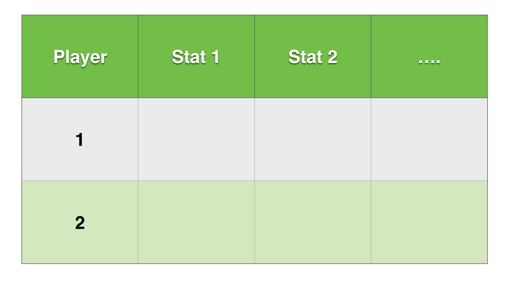

```{r setup, include = FALSE}
options(htmltools.dir.version = FALSE)

library(dplyr)
library(tidyr)
library(knitr)
library(htmlTable)
```

class: slide-img

# Data Wrangling

.left[
* Data wrangling is the process of going from messy data to data that can be analyzed

* It's not always fun but tools in *R* help to avoid a lot of headaches 
]

.right[

]

---


class: slide-img

# Goal of Tidying 

When _tidying_ our goal is to end up with a row-by-column structure of our data, that has clearly named variables and valid values. 


---

class: slide-img

# Tidying Unstructured Data 

--

- When scraping Web data, as we often do in sport, the data can be messy.

--

- It is typical to need some programming to get the data into a nice row by column structure

--

- String manipulation is a common task in this processed and can be tackled with the `stringr` package

---

# Common Data Wrangling Steps 

1. Manipulating strings

2. Selecting

3. Transforming

4. Reshaping

5. Validity check

---


# Example: Match Statistics

Recall the example from the Zverev v Djokovic tennis match that we pulled from the ATP site using `RSelenium`. The extracted data is in a single string, so it is unstructured and needs to be tidied up.

Let's store those results in the object `match_stats`.

```{r echo = FALSE, message = FALSE}
library(WOMBATsport)

data(match_stats)
```

```{r eval = FALSE}
match_stats
```


---

# What Is Needed?

To get this string of match statistics into a data frame we can work with, we need to:

--

<br>

1. Identify the target structure (that is, variables and value types)

2. Split the string into the different variables

3. Extract values 

4. Assign to variables in a data.frame

5. Convert values to appropriate types

---

# Example: Target Structure

We have a set of statistics for each player. One option is a "long"" format with the following structure:

<br>

<div align="center">

</div>


---

# Question: Target Structure

Suppose we instead wanted a "wide" format. How would that differ?

<br>
--

_Answer:_

<div align="center">

</div>

---

# Example: Splitting

```{r}
library(stringr) # Load stingr

str_split(match_stats, "\n") # Split on return characters
```

---

# Group Data by Pattern

- Now that we have isolated some of the main elements of our data as a vector, we want to group data by type. 

- We can use pattern-matching to separate strings by their pattern

- Several useful `stringr` packages for pattern matching include:

--

<br>

```{r eval = FALSE}
str_detect(x, pattern) # Test each element for presence of pattern

str_subset(x, pattern) # Subset x by where pattern is found

str_extract(x, pattern) # Extracts first occurrence of pattern
```

---

# Regular Expressions

- By default, the `pattern` is assumed to be a _regular expression_.

- A *regular expression* describes a pattern in a string and is very powerful for pattern-finding. 

- Find more about `regex` in R [here](https://stat.ethz.ch/R-manual/R-devel/library/base/html/regex.html)


<div align="center">

</div>


---

# Example: Using RegEx to Sort Data

Looking at our example, we can separate the stats by using a pattern that finds elements with at least one lower-case letter

```{r}
split <- str_split(match_stats, "\n")[[1]] # Save split vector

pattern <- "[a-z]"

stats <- str_subset(split, pattern) # Subset players and stat names
```

---

# Example: Using RegEx to Sort Data

We use exclusion to get all the other values

```{r}
values <- split[
	!str_detect(split, pattern) &
	!str_detect(split, "[A-Z]")
 ] # Get values
```

---

# Practice: Using RegEx to Sort Data

There are a number of other ways we could isolate the statistic values from the other content of our string.

Find an alternative.

--

_Answer:_ An equivalent alternative uses the unique ending character

```{r}
values <- str_subset(split, "[[0-9]\\)\\%]$")
```

---

# Question: Using RegEx to Sort Data

Why didn't we just use the `[0-9]` regular expression to isolate the statistic values?

--

_Answer:_

Because the name of some statistics includes numbers, this wouldn't isolate the values.

```{r}
str_subset(split, "[0-9]")
```

---

# Example: Structuring Data Frame

We notice that some stats have just counts while others have percentages and ratios. We can deal with this by flagging counts and expanding the data frame based on the condition of being a count or percentage stat.

```{r}
counts <- stats %in% c("Aces", 
		"Double Faults", 
		"Service Games Played", 
		"Return Games Played")

data.frame(
	stat = rep(stats, ifelse(counts, 2, 4)),
	values = values
)
```

---

# Example: String Substitution

We will need to do some more tidying of the strings to get our `value` column into numeric values. String replace will be a big help. Here are some examples of removing percentage signs and parentheses using `str_replace`.


```{r}
# We use 'all' to replace all instances
# The escapes \\ make sure () are treated as fixed
str_replace_all(values,"[\\(%\\)]", "")
```


---

# Practice: String Substitution

1. Use the `str_replace_all` function to prepare the `valuea` column of our data set for numeric conversion

2. Convert the values to numeric

3. Check that the first serve percentage won matches the proportion from the ratio form

---

# Solution: String Substitution

```{r}
match_stats <- data.frame(
	stat = rep(stats, ifelse(counts, 2, 4)),
	values = str_replace_all(values,"[\\(%\\)]", ""),
	stringsAsFactors = FALSE
)

match_stats <- match_stats %>%
  rowwise() %>%
  dplyr::mutate(
    values = ifelse(!str_detect(values, "/"), as.numeric(values),
      "/"(as.numeric(str_extract_all(values, "[0-9]+")[[1]])[1],
          as.numeric(str_extract_all(values, "[0-9]+")[[1]])[2]))
  )

subset(match_stats, stat == "1st Serve Points Won")
```

---
# Tidying Structured Data

Sometimes we get data in a row by column format but there are still problems with data values. Some common issues with sports data are:

- Untidy strings
- Incorrect class
- Missing values
- Hidden missing values
- Bad labelling
- Transforming dates
- Alternative names/Misspelling

---

# Manipulating Structured Data

* Many of the tools we need when working with data in `data.frames` come from the `dplyr` package. 

* `dplyr` provides a grammar for data manipulation

* Install with the following command:

<br>

```{r eval = FALSE}
library(devtools)

install_github("hadley/dplyr") # Install dev version
```

---

# Tools of `dplyr`

This is an overview of `dplyr` tools. We will apply these throughout the remainder of the tutorial.

```{r echo = FALSE}
data <- data.frame(
  "Tool" = c("select", "filter", "mutate", "summarise", "group_by", "%>%"),
  "Description" = c(
    "Column subsetting",
    "Row subsetting",
    "Transform or create variables",
    "Summarise variables (i.e., many values to one)",
    "Apply tools by grouping variables",
    "Pipe operator for chaining multiple commands"
  )
)


htmlTable(data, 
          rnames = F, 
          col.rgroup = c("none", "#F7F7F7"),
          align = c("ll"),
          css.cell = "padding-left: 5%; padding-right:0%; padding-top: 2%;padding-bottom: 2%;"
          )
```


---

# Reshaping Structured Data

* Sometimes we need to do more than change individual columns and rows

* When we want to _reshape_ the structure of our data we can use `tidyr`

* The `tidyr` package provides a grammar for data reshaping

<br>

```{r eval = FALSE}
library(devtools)

install_github("hadley/tidyr") # Install dev version
```

---

# Tools of `tidyr`

This is an overview of `tidyr` tools. Like `dplyr`, we will illustrate these `tidyr` tools as we go through the tutorial. 

```{r echo = FALSE}
data <- data.frame(
  "Tool" = c("gather", "spread", "separate"),
  "Description" = c(
    "Takes multiple columns, and gathers them into key-value pairs. Goes from wide to long format.",
    "Takes key-value pair and spreads them in to multiple columns. This goes from long to wide format.",
    "Breaks up a single column into multiple."
  )
)

htmlTable(data, 
          rnames = F, 
          col.rgroup = c("none", "#F7F7F7"),
          align = c("ll"),
          css.cell = "padding-left: 5%; padding-right: 0%;padding-top: 2%;padding-bottom: 2%;"
          )
```


---

# Objective: Scoring Surprising Event Results

.left[
* We will walk through a number of common tidying steps using a real-world example

* Suppose we want to measure which player had the most surprising Australian Open performance in the past 3 years

* Let's use the match result info from [www.tennis-data.co.uk](http://www.tennis-data.co.uk/) to try to get at this question
]

.right[
<div align="center">

</div>
]


.footnote[
[1] Denis Istomin after upset of Novak Djokovic at 2017 AO
]
---

# Importing the Data

* First, we need to read-in the data from the site for the years 2015 to 2017

* Each year is stored in a separate file with a URL that has the following pattern:

```{r eval = FALSE}
"http://www.tennis-data.co.uk/year/ausopen.csv"
```


---

# Practice: String and Import

How would you use the URL pattern to get a single data frame of the results for AOs 2015 to 2017?

--

<br>

_Answer:_

```{r}
url <- "http://www.tennis-data.co.uk/year/ausopen.csv"

years <- sapply(2015:2017, function(x) sub("year", x, url))

data <- do.call("rbind", lapply(years, read.csv))
```

---

# Checking for Messy Data

--

- With any data directly from the Web we need to be on guard for some messiness

--

- The first step to diagnosing the messy issues, is to inspect each variable in the dataset. 

--

- I recommend separating characters and numeric.

--

- Sort and look at unique values for character type 

--

- Use summary on each numeric type

---

# Inspect Classes

The code below evaluates the classes in our dataset. What do we conclude from this?

```{r}
# Check classes
table(apply(data, 2, class))
```

<br>

*Note:* All character classes should make you suspect some need for class conversion

---

# Inspect Variables

To learn more about the contents of each variable and any issues we need to address, I like to use the `ask` function of `gtools`. Here is how we can use it to inspect variables one at a time. 

```{r echo = TRUE, eval = FALSE}
library(gtools) # For ask function

# Inspection loop
for(name in names(data)){
	print(name)
    print(sort(unique(data[,name])))
    ask()
}
```

---

# Practice: Inspect Variables

Complete the inspection step in the previous slide. Determine:

<br>

1. What variables does the dataset contain?

2. Which variables are relevant to measuring event surprising event outcomes by player and year?

3. Are there any issues with those variables we need to address?

---

# Solution: Inspect Variables

- The dataset contains winner and loser info for each match along with the pre-match Odds by several different bookmakers

- The 'Date', 'Winner', and one or more of the odds will be used to measure a player's event performance

- We need to create a 'Year' variable, check for duplicates/variants in spelling among Winner names, create a 'surprise score' for each win, and filter out 'Retirements' matches

--

<br>

<h3 style="color:#f2ca95;">Let's get started...</h3>

---

# Date Conversion

* Since we often will want to perform calculations with dates, we should convert them to a `Date` object. This is easy to do using the `lubridate` package.

* `lubridate` has conversion functions that are named according to the format of our input. 

```{r echo = FALSE}
data.table <- data.frame(
  "Function" = c("dmy", "mdy", "ymd"),
  "Example" = c("3/2/99", "12302017", "1981-10-21")
)

htmlTable(data.table, 
          rnames = F, 
          col.rgroup = c("#fff", "#eeeeee"),
          css.cell = "width:80%;text-align:center;",
          css.table = "margin-left:20%;")
```

<br>

*Note* that the delimiter is generally unimportant.

---

# Convert Date and Make Year

In this code we will use `lubridate` and `dplyr` to convert the `Date` variable and create the variable `Year`. 

```{r message = FALSE}
library(dplyr) # dplyr for data manipulation
library(lubridate) # date manipulation

data <- data %>%
	dplyr::mutate(
		Date  = dmy(Date),
		Year = year(Date)
	)
```

<br>

*Note:* `%>%` is a piping operator

---

# Surprise Score

.left[
** What should define a surprising event performance? **

- A string of big upsets is one definition

- We can use the bookmaker odds to measure what a player was expected to do and compare that against their actual wins

- A more surprising result is one that exceeds expectations

- The sum of this 'surprise score' over all of a player's wins will be their event 'Surprise Score'
]

.right[

]

---

# Which Odds?

There are several odds to choose from. Without knowing more about the bookmakers, we will choose one of the odds that is most complete across matches. To do this, we need to check for missing values.

```{r}
data %>%
	select(B365W:AvgL) %>%
	summarise_all(
		funs(sum(is.na(.)))
	)
```


---

# Create Suprise Score

We will use the `B365W` odds for the winner and do the simple inversion to estimate the expected win chances for the player.

<br>

```{r}
data <- data %>% 
	dplyr::mutate(
		SurpriseScore = 1 - 1 / as.numeric( B365W)
	)	
```

.footnote[
[1] Remember we needed to convert to numeric before making this calculation
]

---

# Cleaning Names

- Before we can summarise results by `Winner` we need to check the validity of the names

- One of the most troublesome issues with sports data are inconsistent naming of players. This is a problem when you need to assign performance measures to the same individual, based on their name.


- Some of the "inconsistencies" you have to be prepared for are:

  - Misspellings
  - Differences in punctuation
  - Middle names
  - Multiple surnames
  - Abbreviations

---

# Approximate `grep`

The `agrep` function performs approximate matching, and is a _very_ useful function for cleaning up names in sports data. It looks at the distance between the input `x` and a `pattern`, using the Levenshtein edit distance.

```{r eval = FALSE}
agrep(pattern, x, max.distance = 0.1, costs = NULL, ...) 
```

<br>

Most of the arguments are like the usual `grep` except for two: `max.distance` and `costs`.

`max.distance`: Numeric for the maximal distance

`costs`: Numeric cost for the Levenshtein edit distance

---


# Example `agrep`

Here we look for possible inconsistencies in the `Winner` variable using `agrep`.

```{r}
players <- sort(unique(as.character(data$Winner))) # Get unique players

approx <- lapply(players, agrep, fixed = T, x = players) 
# Compare each player against all others

players[sapply(approx, length) > 1] 
# Look for cases with multiple matches
```

---

# Practice: Cleaning Names

Based on the results from our inspection in the previous slide, which changes do you think are needed to the `Winner` variable?

--

<br>

_Answer:_

Bautista Agut is the only name with true variants, so we will choose one.

<br>

```{r}
data$Winner[data$Winner == "Bautista Agut R."] <- "Bautista R."
```

---

# Total Surprise Score

We are now ready to compute a total surprise score for each player and year. Using `summarise`, find the top 10 most surprising performances in the past 3 years.

--

_Answer:_

```{}
summarise_wins <- data %>%
	filter(Comment != "Retired") %>% # Remember to remove retirements
	group_by(Year, Winner) %>%
	dplyr::summarise(
		TotalSurpriseScore = sum(SurpriseScore)
	)

summarise_wins[order(summarise_wins$TotalSurpriseScore, decreasing = T),][1:10,]
```

---

# What About Losses?

--

- Suppose we had wanted a score based on wins and losses, what would we need to do this?

--

- We would need to switch to a _long_ format which means reshaping our data

---

# Reshaping Data

In addition to transforming individual variables, we often will want to reshape our data from wide to long or long to wide formats.


---

# Going from Wide to Long

To go from wide to long format, we can use the `tidyr` `gather` function. Here is an example.

```{r eval = FALSE}
library(tidyr) # load tidyr for reshaping

data %>%
  gather("name", "value", x1, x2, x3)
```

--

<br>

In the above, we stack the variables `x1`, `x2` and `x3`, creating a categorical variable `name` with the variable names and the column `value` with all of the grouped values.

---

# Going from Long to Wide

To go from long to wide format, we can use the `tidyr` `spread` function. Here is an example.

```{r eval = FALSE}
data %>%
  spread(key = name, value)
```

--

<br>

In this example we undo with long format by providing the set of new columns to create with the variable supplied to `key`. 

The values that will be inserted into those columns is indicated with the `value` variable.

---

# Practice: Reshaping

Use the `tidyr` package to create a long format of our data that groups `Winner` and `Loser` into a single `player` column.

--

_Answer:_

```{r}
data <- data %>%
  gather("Outcome", "Player", Winner, Loser)

head(data[,c("Date", "Outcome", "Player")])
```

---

# Resources

- [dplyr](https://cran.rstudio.com/web/packages/dplyr/vignettes/introduction.html)

- [tidyr](https://blog.rstudio.org/2014/07/22/introducing-tidyr/)

- [lubridate](https://www.r-statistics.com/2012/03/do-more-with-dates-and-times-in-r-with-lubridate-1-1-0/)

- [agrep](http://astrostatistics.psu.edu/su07/R/html/base/html/agrep.html)

- [regex]([here](https://stat.ethz.ch/R-manual/R-devel/library/base/html/regex.html)

